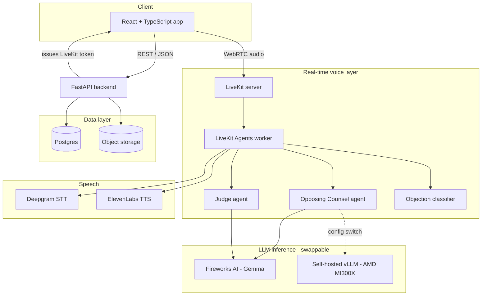
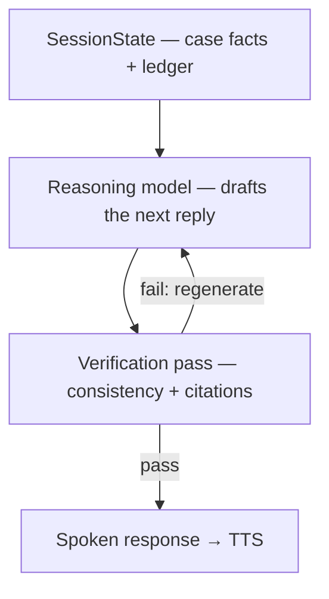

# LexPar AI — Technical Architecture

**Status:** Living document. Update this whenever an architectural decision changes — it is the
single source of truth for the project across chat sessions, contributors, and Claude Code runs.
Pair it with `CLAUDE.md` at the repo root, which should simply point here for full context.

---

## 1. Overview

LexPar AI is a voice-immersive courtroom rehearsal platform for solo and independent trial
lawyers. An attorney speaks their argument aloud against an AI Opposing Counsel that can
interrupt mid-sentence with objections, followed by an AI Judge that delivers a spoken ruling
and a written scorecard.

Built for the AMD Developer Hackathon (Unicorn track), architected to survive past it as a real
product.

---

## 2. Repository structure

Single monorepo. One repo, one source of truth, no cross-repo version drift for a solo build.

```
lexpar-ai/
├── frontend/                    React + TypeScript (Vite)
│   ├── src/
│   │   ├── components/          Shared UI (shadcn/ui + Tailwind)
│   │   ├── pages/
│   │   │   ├── Login.tsx
│   │   │   ├── Dashboard.tsx
│   │   │   ├── CaseUpload.tsx
│   │   │   ├── SparringRoom.tsx     LiveKit room UI (live session)
│   │   │   └── Scorecard.tsx
│   │   ├── hooks/
│   │   ├── store/                auth.ts, session.ts (Zustand)
│   │   ├── lib/                  api.ts (REST client), livekit.ts (room client wrapper)
│   │   └── App.tsx                routes + auth guard
│   ├── vite.config.ts
│   └── package.json
│
├── backend/                     FastAPI (non-realtime REST API)
│   ├── app/
│   │   ├── main.py
│   │   ├── api/
│   │   │   ├── auth.py           login stub, token issuance
│   │   │   ├── cases.py          case upload / list / detail
│   │   │   ├── sessions.py       session lifecycle, transcript retrieval
│   │   │   ├── scorecards.py
│   │   │   └── livekit_token.py  issues LiveKit room access tokens
│   │   ├── models/               SQLAlchemy models
│   │   ├── db.py
│   │   └── config.py             reads .env
│   ├── requirements.txt
│   └── Dockerfile
│
├── agents/                      LiveKit Agents worker (real-time voice pipeline)
│   ├── main.py                   entrypoint, room join logic
│   ├── opposing_counsel.py       agent persona + prompt
│   ├── judge.py                  agent persona + prompt
│   ├── objection_classifier.py   watches live partial transcript, fires interrupts
│   ├── llm_router.py             switches Fireworks <-> self-hosted vLLM per agent
│   ├── requirements.txt
│   └── Dockerfile
│
├── infra/
│   ├── docker-compose.yml        local dev: postgres, minio (local S3), livekit server
│   ├── docker-compose.prod.yml   AMD Developer Cloud deployment
│   └── deploy.sh
│
├── docs/
│   └── ARCHITECTURE.md           this file
│
├── .github/workflows/ci.yml      lint, test, build images on every push
├── CLAUDE.md                     points Claude Code here + operational notes
└── .env.example
```

---

## 3. System diagram



Key point encoded in the diagram: **the Opposing Counsel agent's LLM backend is a config switch,
not two code paths.** Both Fireworks and self-hosted vLLM expose OpenAI-compatible endpoints, so
`llm_router.py` just reads an environment variable.

---

## 4. Frontend

**Stack:** React 18 + TypeScript, Vite, Tailwind CSS + shadcn/ui, Zustand (client state),
TanStack Query (server state), `@livekit/components-react` + `livekit-client` (real-time audio).

**Routes:**

| Route | Purpose | Auth required |
|---|---|---|
| `/login` | Login form | no |
| `/dashboard` | List of cases | yes |
| `/case/new` | Upload case facts / documents | yes |
| `/session/:id` | Live sparring room (LiveKit connection) | yes |
| `/session/:id/scorecard` | Post-session results | yes |

### Login form (placeholder auth)

Included now as real UI, wired to a stub backend — not a mock, an actual login form hitting an
actual endpoint, just with hardcoded credentials behind it for now.

- Form posts `{ username, password }` to `POST /api/auth/login`.
- Backend (see §5) accepts only `admin` / `admin` while `AUTH_MODE=stub`, returns a signed JWT.
- Frontend stores the token in memory (Zustand `auth` store) and attaches it as a Bearer token on
  subsequent requests. Not localStorage — keeps it out of persistent browser storage even in
  placeholder form, so the swap to real auth later doesn't also require a storage migration.

**⚠️ Flagged for replacement:** this must not ship to any real attorney or real case data while
`AUTH_MODE=stub`. Tracked in §11 (Open items).

### Wiring status (frontend ↔ backend)

The frontend now calls the **real** backend through `lib/api.ts` for auth (login + `/api/auth/me`,
which `ProtectedRoute` uses to validate the session), cases (list/create), session creation, and
scorecard retrieval. Two things remain mocked/absent until the agents pipeline exists:

- **Transcript playback** in `SparringRoom` is still a scripted, timer-driven sequence (there is no
  live STT→LLM→TTS yet). Starting a session still exercises real plumbing: it creates a real
  `sessions` row (POST /api/sessions) and fetches a real LiveKit token (GET /api/livekit/token).
- **Scorecards** aren't generated yet (that's the Judge agent's job), so the session stays
  `in_progress` and GET scorecard returns 409/404. The frontend shows an honest "not available yet"
  fallback rather than fabricating a score.

---

## 5. Backend (FastAPI)

| Method | Path | Description | Auth |
|---|---|---|---|
| POST | `/api/auth/login` | Validates credentials (stub: `admin`/`admin`), issues JWT | no |
| GET | `/api/auth/me` | Returns current user from token | yes |
| POST | `/api/cases` | Upload case facts + documents | yes |
| GET | `/api/cases` | List attorney's cases | yes |
| GET | `/api/cases/{id}` | Case detail | yes |
| POST | `/api/sessions` | Start a new sparring session for a case | yes |
| GET | `/api/sessions/{id}` | Session status + transcript | yes |
| GET | `/api/sessions/{id}/scorecard` | Scorecard after session ends | yes |
| GET | `/api/livekit/token` | Issues a LiveKit room access token for the frontend | yes |

FastAPI does not touch real-time audio at all — that's entirely the LiveKit Agents worker's job.
FastAPI's role is auth, case management, and persisting the results the agents worker produces.

---

## 6. Real-time voice layer (LiveKit)

- **LiveKit server**: self-hosted (open-source, Apache-2.0), runs in Docker locally and on the
  AMD droplet in production. Can migrate to LiveKit Cloud later without touching agent code.
- **LiveKit Agents worker**: Python framework handling the STT → LLM → TTS pipeline, built-in
  VAD + semantic turn detection for natural barge-in.
  - `opposing_counsel.py` — cross-examines, objects, counter-argues.
  - `judge.py` — monitors the session, delivers rulings.
  - `objection_classifier.py` — **the custom, differentiating piece.** Watches Deepgram's live
    partial transcripts of the attorney's speech and decides, in real time, when the Opposing
    Counsel should interrupt with an objection. This is bespoke logic on top of the framework,
    not something LiveKit provides out of the box.
  - `llm_router.py` — reads `OPPOSING_COUNSEL_LLM_PROVIDER` / `JUDGE_LLM_PROVIDER` env vars and
    points each agent at the correct OpenAI-compatible endpoint.

---

## 6.5 Memory & verification

Two things keep the spoken replies trustworthy under real-time pressure: a structured memory of the
session, and a verification pass before anything is spoken.

### Session memory (`SessionState`)

Each active session holds a structured, in-memory `SessionState` (`agents/session_state.py`) — not
just a chat transcript:

- **case_facts** — the immutable facts supplied when the session starts.
- **established_facts** — a ledger of facts established during the session (entered into evidence,
  stipulated, or stated without objection).
- **objections** — a ledger of objections: the grounds, who raised it, and the judge's ruling
  (`pending` → `sustained` | `overruled`).

This lets Opposing Counsel and the Judge reason about *what's actually on the record* instead of
re-deriving it from raw transcript each turn, and it is the ground truth the verification pass
checks against. It lives in memory for the session's lifetime; durable copies persist through the
backend models (`transcripts`, `scorecards`) — the raw ledger is never logged.

### Verification pass (before TTS)

After the reasoning model drafts a reply, a verification pass runs **before** the reply reaches
TTS. It checks:

1. **Consistency** against `SessionState` — the reply must not contradict `case_facts`,
   `established_facts`, or standing objection rulings (e.g. don't rely on testimony that was just
   stricken on a sustained objection).
2. **Fabricated legal citations** — a heuristic checker (`agents/verification.py`) flags
   citation-shaped text with unrecognized reporters or implausible years; an LLM/DB-backed check
   comes later.

On **fail**, the draft is discarded and the reasoning model regenerates (bounded retries). On
**pass**, the reply goes to TTS.



### Co-location

Once the reasoning model is self-hosted on the AMD MI300X (§7), the verification model runs **on the
same GPU** as the reasoning model — the check is a local forward pass, not a network hop, so it fits
inside the turn's latency budget. While both run on Fireworks, verification is simply a second API
call.

### Implemented now vs. pending keys

- **Implemented + tested (no keys):** `SessionState` and its update methods; the regex citation
  heuristic (`find_suspicious_citations`).
- **Stubbed (pending Fireworks/AMD keys):** the LLM-based consistency check —
  `# TODO: implement once Fireworks/AMD keys are available` in `agents/verification.py`.

---

## 7. LLM inference routing

| Agent | Default (now) | Post-droplet option | Why |
|---|---|---|---|
| Opposing Counsel | Fireworks AI | Self-hosted vLLM on AMD MI300X | Proves AMD platform ownership for the hackathon; switch to self-hosted once session volume justifies dedicated GPU uptime |
| Judge | Fireworks AI (Gemma) | Stays on Fireworks | Required for Gemma bonus prize eligibility — do not self-host this one |

Switching is a config change (`.env` value), never a code change — this is deliberate.

---

## 8. Database schema (Postgres)

```sql
CREATE TABLE users (
    id UUID PRIMARY KEY DEFAULT gen_random_uuid(),
    email TEXT UNIQUE NOT NULL,
    full_name TEXT,
    password_hash TEXT,             -- NULL while AUTH_MODE=stub
    firm_name TEXT,
    created_at TIMESTAMPTZ DEFAULT now()
);

CREATE TABLE cases (
    id UUID PRIMARY KEY DEFAULT gen_random_uuid(),
    user_id UUID REFERENCES users(id),
    title TEXT NOT NULL,
    case_facts TEXT,
    storage_path TEXT,               -- object storage key for uploaded file
    created_at TIMESTAMPTZ DEFAULT now()
);

CREATE TABLE sessions (
    id UUID PRIMARY KEY DEFAULT gen_random_uuid(),
    case_id UUID REFERENCES cases(id),
    user_id UUID REFERENCES users(id),
    status TEXT DEFAULT 'in_progress',   -- in_progress | completed | abandoned
    llm_backend_used TEXT,               -- 'fireworks' | 'self_hosted'
    started_at TIMESTAMPTZ DEFAULT now(),
    ended_at TIMESTAMPTZ
);

CREATE TABLE transcripts (
    id UUID PRIMARY KEY DEFAULT gen_random_uuid(),
    session_id UUID REFERENCES sessions(id),
    speaker TEXT NOT NULL,               -- 'attorney' | 'opposing_counsel' | 'judge'
    content TEXT NOT NULL,
    was_interruption BOOLEAN DEFAULT false,
    spoken_at TIMESTAMPTZ DEFAULT now()
);

CREATE TABLE scorecards (
    id UUID PRIMARY KEY DEFAULT gen_random_uuid(),
    session_id UUID REFERENCES sessions(id) UNIQUE,
    overall_score NUMERIC,
    strengths TEXT,
    weaknesses TEXT,
    judge_ruling TEXT,
    created_at TIMESTAMPTZ DEFAULT now()
);
```

## Object storage layout

```
cases/{case_id}/{original_filename}
```

S3-compatible (MinIO locally, DigitalOcean Spaces in production).

### Backend implementation notes (as built)

- **Migrations:** the schema is created and versioned with **Alembic** (`backend/alembic/`), not
  `create_all` on startup. Run `alembic upgrade head` before serving. Tests build the schema from
  `Base.metadata` on SQLite, so CI needs no database service.
- **Portable column types:** models use SQLAlchemy's `Uuid` type and application-side defaults
  (`uuid4`, timezone-aware `datetime.now`) rather than Postgres server defaults
  (`gen_random_uuid()`, `TIMESTAMPTZ`). The same models therefore run unchanged on Postgres
  (prod) and SQLite (tests).
- **Soft deletes:** `users`, `cases`, and `sessions` carry a nullable `deleted_at`; queries
  exclude it (DEVELOPER_GUIDELINES §8), so a retention policy later is a query change, not a
  schema migration.
- **Sensitive fields** (`cases.case_facts`, `transcripts.content`, scorecard text) are tagged
  `# SENSITIVE: attorney work product` in the models and never logged.

---

## 9. Environment variables

| Variable | Purpose |
|---|---|
| `DATABASE_URL` | Postgres connection string |
| `OBJECT_STORAGE_ENDPOINT` / `OBJECT_STORAGE_BUCKET` | S3-compatible file storage |
| `LIVEKIT_URL` / `LIVEKIT_API_KEY` / `LIVEKIT_API_SECRET` | LiveKit server connection |
| `OPPOSING_COUNSEL_LLM_PROVIDER` | `fireworks` \| `self_hosted` |
| `OPPOSING_COUNSEL_LLM_ENDPOINT` | OpenAI-compatible URL for whichever provider is active |
| `JUDGE_LLM_PROVIDER` | keep as `fireworks` (Gemma bonus eligibility) |
| `JUDGE_LLM_ENDPOINT` | Fireworks Gemma endpoint |
| `FIREWORKS_API_KEY` / `DEEPGRAM_API_KEY` / `ELEVENLABS_API_KEY` | Provider auth |
| `JWT_SECRET` | Token signing |
| `AUTH_MODE` | `stub` \| `production` |
| `CORS_ORIGINS` | Comma-separated browser origins allowed to call the API (e.g. the Vite dev server) |

Never commit `.env` — `.env.example` documents the shape, real values stay local/secrets-managed.

**Frontend env:** the React app reads `VITE_API_BASE_URL` (default `http://localhost:8000`) to reach
the backend — see `frontend/.env.example`. Vite only exposes vars prefixed `VITE_` to the browser.

---

## 10. Deployment

- **Local dev:** `docker-compose.yml` — Postgres, MinIO, LiveKit server, backend, agents, frontend
  dev server, all on your machine. Both LLM agents point at Fireworks until the AMD droplet exists.
- **Production (AMD Developer Cloud):** `docker-compose.prod.yml` on the droplet. CI builds and
  tags images on every push; deploy is `docker compose pull && docker compose up -d`.
- **CI (`.github/workflows/ci.yml`):** lint + type-check + test + build images on every push, so
  the droplet only ever pulls images that have already passed CI — never building for the first
  time under deployment pressure.

---

## 11. Open items / roadmap

- [ ] Replace `AUTH_MODE=stub` (admin/admin) with real auth before any real attorney or real case
      data touches the system.
- [ ] Cut the Opposing Counsel agent over to self-hosted vLLM once the AMD droplet exists and
      hackathon submission is locked in.
- [ ] Re-evaluate self-hosted vs. Fireworks-only for production once real session volume exists
      (see cost model discussion — fixed GPU cost only pays off at volume).
- [ ] Billing integration (Stripe) — not needed until first paying customer.
- [ ] Data retention / encryption policy written down explicitly before onboarding real attorneys.
