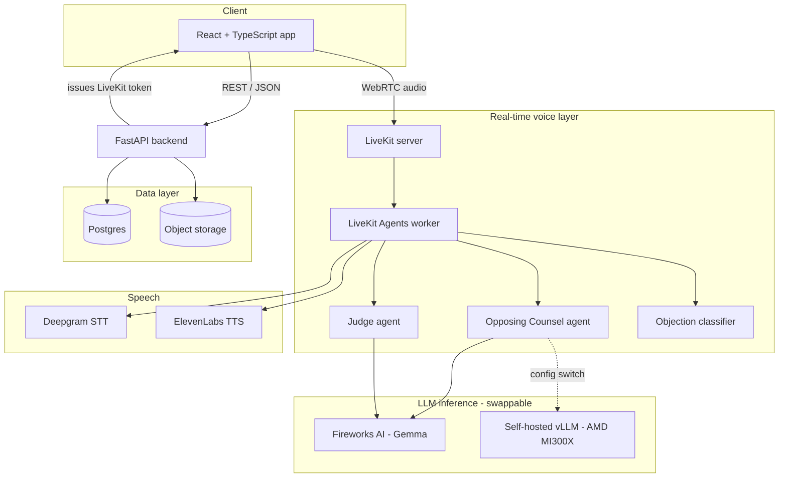
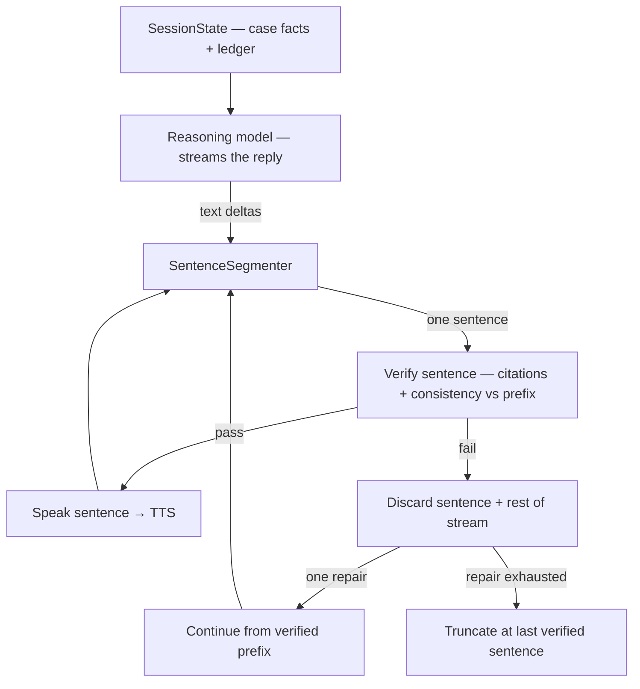

# LexPar AI — Technical Architecture

**Status:** Living document. Update this whenever an architectural decision changes — it is the
single source of truth for the project across chat sessions, contributors, and Claude Code runs.
Pair it with `CLAUDE.md` at the repo root, which should simply point here for full context.

---

## 1. Overview

LexPar AI is a voice-immersive courtroom rehearsal platform for solo and independent trial
lawyers. An attorney speaks their argument aloud against an AI Opposing Counsel that can
interrupt mid-sentence with objections, followed by an AI Judge that delivers a spoken ruling
and a written scorecard.

Built for the AMD Developer Hackathon (Unicorn track), architected to survive past it as a real
product.

---

## 2. Repository structure

Single monorepo. One repo, one source of truth, no cross-repo version drift for a solo build.

```
lexpar-ai/
├── frontend/                    React + TypeScript (Vite)
│   ├── src/
│   │   ├── components/          Shared UI + app shell (AppLayout, UserMenu, Breadcrumbs; shadcn/ui + Tailwind)
│   │   ├── pages/
│   │   │   ├── Login.tsx
│   │   │   ├── Dashboard.tsx         Cases list
│   │   │   ├── CaseUpload.tsx
│   │   │   ├── CaseDetail.tsx        case hub — facts, start session, rehearsal history
│   │   │   ├── Profile.tsx           read-only identity + role
│   │   │   ├── Admin.tsx             Court administration (§13, admin only)
│   │   │   ├── SparringRoom.tsx      LiveKit room UI (live session)
│   │   │   └── Scorecard.tsx
│   │   ├── hooks/
│   │   ├── store/                auth.ts, session.ts (Zustand)
│   │   ├── lib/                  api.ts (REST client), livekit.ts (room client wrapper)
│   │   └── App.tsx                routes + auth guard
│   ├── vite.config.ts
│   └── package.json
│
├── backend/                     FastAPI (non-realtime REST API)
│   ├── app/
│   │   ├── main.py
│   │   ├── api/
│   │   │   ├── auth.py           login/register, token issuance, admin bootstrap
│   │   │   ├── cases.py          case CRUD + pleading upload/ingest (§12)
│   │   │   ├── courts.py         court catalog + rule-corpus upload (§13, admin-gated)
│   │   │   ├── sessions.py       session lifecycle, transcript retrieval
│   │   │   ├── scorecards.py     scorecard + ruling-provenance read (§13)
│   │   │   ├── internal.py       agent-token routes (context/knowledge/court-rules/provenance)
│   │   │   └── livekit_token.py  issues LiveKit room access tokens
│   │   ├── models/               SQLAlchemy models (incl. §12/§13: court, court_rule, ruling_provenance)
│   │   ├── services/             business logic (case/court knowledge, embeddings, storage, auth)
│   │   ├── prompts/              prompt_loader.py + *.md (pleading summarizer) — backend twin of agents/prompts.py
│   │   ├── db.py
│   │   └── config.py             reads .env
│   ├── requirements.txt
│   └── Dockerfile
│
├── agents/                      LiveKit Agents worker (real-time voice pipeline)
│   ├── main.py                   entrypoint, room join logic
│   ├── opposing_counsel.py       agent persona + prompt
│   ├── judge.py                  agent persona + prompt
│   ├── objection_classifier.py   watches live partial transcript, fires interrupts
│   ├── case_knowledge.py         pleading retrieval (§12); court_knowledge.py = rules retrieval (§13)
│   ├── citation_check.py         turn-scoped citation grounding check (§13)
│   ├── llm_router.py             switches Fireworks <-> self-hosted vLLM per agent
│   ├── prompts.py                prompt registry: render()/cache for EVERY LLM prompt (DEV §10)
│   ├── prompts/                  all agent prompt text (personas + sub-task prompts), one *.md each
│   ├── requirements.txt
│   └── Dockerfile                (planned — not yet written; only backend/Dockerfile exists today)
│
├── scripts/
│   └── seed_court.py             OPTIONAL headless court/rules seeding (§13; NOT the operator path)
│
├── infra/
│   ├── docker-compose.yml        local dev: postgres, minio (local S3), livekit server
│   ├── docker-compose.prod.yml   (planned — AMD Developer Cloud deployment; not yet written)
│   └── deploy.sh                 (planned — not yet written)
│
├── docs/
│   ├── ARCHITECTURE.md           this file
│   ├── DEVELOPER_GUIDELINES.md   coding conventions, testing baseline, pre-merge checklist
│   └── LESSONS.md                append-only log of past mistakes and their fixes
│
├── .github/workflows/ci.yml      lint + type-check + test; backend image build as a smoke test
├── CLAUDE.md                     points Claude Code here + operational notes
└── .env.example
```

---

## 3. System diagram



Key point encoded in the diagram: **the Opposing Counsel agent's LLM backend is a config switch,
not two code paths.** Both Fireworks and self-hosted vLLM expose OpenAI-compatible endpoints, so
`llm_router.py` just reads an environment variable.

---

## 4. Frontend

**Stack:** React 18 + TypeScript, Vite, Tailwind CSS + shadcn/ui, Zustand (client state),
TanStack Query (server state), `@livekit/components-react` + `livekit-client` (real-time audio).

**Routes:**

| Route | Purpose | Auth required |
|---|---|---|
| `/login` | Login form | no |
| `/dashboard` | Cases list ("Cases" — the authenticated home) | yes |
| `/case/new` | Create a case (title, facts, court) + attach pleading | yes |
| `/case/:id` | Case detail — facts, start a session, rehearsal history | yes |
| `/session/:id` | Live sparring room (LiveKit connection) | yes |
| `/session/:id/scorecard` | Post-session results | yes |
| `/profile` | Profile — read-only identity + role, sign out | yes |
| `/admin` | Court administration (admin only, §13) | yes (admin) |

**App shell & navigation.** All authenticated routes render inside a single shared layout
(`components/AppLayout.tsx`): a topbar with the product name, a primary **Cases** nav item, a
role-gated **Court administration** pill (only when `role === 'admin'`), and a **user menu**
(`components/UserMenu.tsx` → Profile + Sign out). Interior pages (deeper than the Cases list) carry
a consistent **breadcrumb strip** (`components/Breadcrumbs.tsx`, e.g. `Cases › {Case} › Scorecard`)
instead of ad-hoc back buttons. Starting a session and viewing a case's past scorecards both live on
the case-detail page, backed by `GET /api/cases/{id}/sessions`.

### Login form (placeholder auth)

Included now as real UI, wired to a stub backend — not a mock, an actual login form hitting an
actual endpoint, just with hardcoded credentials behind it for now.

- Form posts `{ username, password }` to `POST /api/auth/login`.
- Backend (see §5) accepts only `admin` / `admin` while `AUTH_MODE=stub`, returns a signed JWT.
- Frontend stores the token in memory (Zustand `auth` store) and attaches it as a Bearer token on
  subsequent requests. Not localStorage — keeps it out of persistent browser storage even in
  placeholder form, so the swap to real auth later doesn't also require a storage migration.

**⚠️ Flagged for replacement:** this must not ship to any real attorney or real case data while
`AUTH_MODE=stub`. Tracked in §11 (Open items).

### Wiring status (frontend ↔ backend)

The frontend now calls the **real** backend through `lib/api.ts` for auth (login + `/api/auth/me`,
which `ProtectedRoute` uses to validate the session), cases (list/create), session creation,
scorecard retrieval, and — once a session is completed — its persisted transcript. Live voice is
the one thing still absent:

- **Live transcript playback** in `SparringRoom` is still a scripted, timer-driven sequence during
  a session (there is no live STT→LLM→TTS producing turns in real time yet). Starting a session
  still exercises real plumbing: it creates a real `sessions` row (POST /api/sessions) and fetches a
  real LiveKit token (GET /api/livekit/token).
- **Live-audio visualization (`SparringVisualizer`).** The room renders an equalizer for the current
  active speaker plus per-participant presence dots — an additive, `aria-hidden` visual above the
  transcript (the text speaker badge remains the real attribution). The equalizer taps the active
  speaker's LiveKit track via `createAudioAnalyser` (a non-playing `AnalyserNode` — no duplicate
  audio pipeline), swapping the analysed track when the speaker changes; analysis + the single
  `requestAnimationFrame`/`<canvas>` draw loop live in `hooks/useAudioVisualization.ts` (pure math in
  `lib/audioBars.ts`), the context resuming off the existing audio-unlock signal. The dots ride the
  coarse `participant.audioLevel` from `ActiveSpeakersChanged` (no extra analyser). No new npm
  dependency (Web Audio via `livekit-client`); reduced-motion drops to a static frame. Builds on the
  §6.5 active-speaker attribution.
- **Session-end verdict finale (`SessionFinale`).** On "End session" the room stays connected while
  the judge composes and speaks the closing ruling (the §6.5 handshake — the browser only navigates
  once `end_complete` arrives, *after* the ruling has played). That window is no longer a dead spot:
  `SparringRoom` renders a judge-focused finale — **AWAITING** (a slow amber "deliberation" wave
  during `assess_session`'s dead air) → **RULING** (the same equalizer reacting to the Judge's live
  track) — before the Scorecard. Frontend-only, driven by existing signals (`ending` +
  `activeSpeaker==='judge'`/`judgeSpeaking`, with a `hasSpoken` latch); pure phase machine in
  `lib/rulingPhase.ts`, reusing `useAudioVisualization` (`idleStyle:'deliberating'`). The Scorecard's
  own not-ready polling is unchanged (a later, post-navigation backstop).
- **Completed sessions render real data.** When the agent worker (or `session_end_harness.py`) posts
  `complete` + `scorecard`, the session goes `completed` and the persisted scorecard + transcript are
  written. `Scorecard.tsx` then renders the **real** heuristic score, strengths, weaknesses, and
  verbatim judge ruling (GET `/api/sessions/{id}/scorecard`), plus a **Transcript** section built
  from the real persisted turns (GET `/api/sessions/{id}`, reusing `TranscriptLine` with the
  objection styling). Multi-line strengths/weaknesses use `whitespace-pre-line` so the per-fact and
  per-objection bullet lines survive. Verified end-to-end offline via the harness (Gap 5).
- **Before a scorecard exists** (session still `in_progress`), GET scorecard returns 409/404 and the
  frontend shows an honest "not available yet" fallback rather than fabricating a score.
- **No dedicated ledger/verification UI.** SessionState's ledger (established facts, objections) and
  the verification pass already flow into the scorecard's score/strengths/weaknesses; they are not
  surfaced as a separate section (deliberately — see Gap 5 in tasks/PLAN.md).

---

## 5. Backend (FastAPI)

| Method | Path | Description | Auth |
|---|---|---|---|
| POST | `/api/auth/register` | Self-service signup (production auth only; §12) | no |
| POST | `/api/auth/login` | Validates credentials (stub: `admin`/`admin`), issues JWT | no |
| GET | `/api/auth/me` | Returns current user from token (incl. `role`) | yes |
| POST | `/api/cases` | Create a case (optional `court_id`, §13) | yes |
| GET | `/api/cases` | List attorney's cases | yes |
| GET | `/api/cases/{id}` | Case detail | yes |
| POST | `/api/cases/{id}/documents` | Upload a pleading PDF → ingest (§12) | yes |
| GET | `/api/cases/{id}/documents` | Pleading ingestion status (§12) | yes |
| GET | `/api/cases/{id}/sessions` | A case's sessions (rehearsal history), newest first | yes |
| GET | `/api/courts` | Active court catalog (case-creation dropdown; §13) | yes |
| POST | `/api/courts` | Create a court (§13) | **admin** |
| POST | `/api/courts/{id}/rules` | Upload an official rule PDF → ingest (§13) | **admin** |
| GET | `/api/courts/{id}/rules` | Rule documents incl. archived (admin corpus surface, §13) | **admin** |
| POST | `/api/courts/{id}/rules/{doc}/replace` | Atomic Replace: supersede on successful ingest (§13) | **admin** |
| DELETE | `/api/courts/{id}/rules/{doc}` | Archive a rule document (soft; out of retrieval) | **admin** |
| POST | `/api/courts/{id}/rules/{doc}/restore` | Un-archive (409 while superseded by a live replacement) | **admin** |
| GET | `/api/courts/{id}/rules/{doc}/impact` | Pre-purge warning: rulings citing this document | **admin** |
| POST | `/api/courts/{id}/rules/{doc}/purge` | PURGE: chunks + row + stored file, gone | **admin** |
| POST | `/api/courts/{id}/archive` | Retire a forum (cascades soft-archive to its documents) | **admin** |
| POST | `/api/courts/{id}/purge` | PURGE a forum (409 while any case references it) | **admin** |
| DELETE | `/api/cases/{id}` | Archive a case (soft, owner default) | yes |
| POST | `/api/cases/{id}/purge` | PURGE a case + everything under it | **admin** |
| DELETE | `/api/cases/{id}/documents/{doc}` | Archive a pleading (soft; out of retrieval) | yes |
| POST | `/api/cases/{id}/documents/{doc}/replace` | Atomic Replace for a corrected pleading | yes |
| POST | `/api/sessions` | Start a session — **`proceeding_type` required** (§13) | yes |
| GET | `/api/sessions/{id}` | Session status + transcript | yes |
| GET | `/api/sessions/{id}/scorecard` | Scorecard after session ends | yes |
| GET | `/api/sessions/{id}/provenance` | Ruling-provenance audit trail for the owner (§13) | yes |
| GET | `/api/livekit/token` | Issues a LiveKit room access token for the frontend | yes |
| GET | `/api/sessions/{id}/context` | (internal) Case facts + `case_summary` + `court_id` + `proceeding_type` at room join | agent token |
| GET | `/api/sessions/{id}/knowledge` | (internal) Pleading retrieval — summary + top passages + chunk ids (§12) | agent token |
| GET | `/api/sessions/{id}/court-rules` | (internal) Court-rules retrieval — passages + chunk ids (§13) | agent token |
| POST | `/api/sessions/{id}/complete` | (internal) Mark session completed | agent token |
| POST | `/api/sessions/{id}/scorecard` | (internal) Write scorecard + full transcript batch at session end | agent token |
| POST | `/api/sessions/{id}/provenance` | (internal) Write one ruling's provenance row (§13) | agent token |

FastAPI does not touch real-time audio at all — that's entirely the LiveKit Agents worker's job.
FastAPI's role is auth, case management, and persisting the results the agents worker produces.

**Internal (agent) routes vs. user routes.** The `agent token` routes above — the worker reads the
case context + knowledge at room join / per turn and writes the results at session end — are
authenticated with a **scoped service credential** (`X-Agent-Token` header, `AGENT_SERVICE_TOKEN`), a
*separate mechanism* from user JWT login (`app/security_agent.py`, not `app/security.py`). Least
privilege (DEV_GUIDELINES §7): the agent token grants only these routes and nothing user-facing; a
user JWT does not grant them. The scorecard write **batches the whole transcript in one call** (no
per-turn round-trips inside the live voice loop). Note `/sessions/{id}/provenance` exists as **both**
an agent-token POST (the worker writes it) and a user GET (the owning attorney reads it) — same path,
distinct method + auth mechanism. The **admin** routes (§13) use a third check, `require_admin` (a
user JWT whose `role == 'admin'`), distinct from both the agent token and an ordinary user JWT.

---

## 6. Real-time voice layer (LiveKit)

- **LiveKit server**: self-hosted (open-source, Apache-2.0), runs in Docker locally and on the
  AMD droplet in production. Can migrate to LiveKit Cloud later without touching agent code.
- **LiveKit Agents worker** (`agents/main.py`, implemented): Deepgram streaming STT → Opposing
  Counsel (Fireworks, via `opposing_counsel.py`, **streamed**) → sentence-level verification
  (§6.5, `streaming_verify.py` — TTS starts on the first verified sentence while the rest is
  still generating) → ElevenLabs **Flash** TTS, with Silero VAD + turn detection. Interim transcripts feed the objection classifier; a `fire`
  decision **barges in** (`session.interrupt()` + an immediate short "Objection — <type>." via the
  tested `voice_interrupt.py` glue). `opposing_counsel.py` / `judge.py` / `verification.py` are used
  verbatim — main.py only wires the audio layer around them. Heavy voice deps live in
  `agents/requirements-voice.txt` (out of CI). **The real audio path — room join, mic→STT, TTS
  playback, VAD, barge-in timing — is only verifiable in a live room with a microphone.**
  - **Prompt registry (`prompts.py`).** Every LLM prompt in the worker — the two personas AND the
    sub-task system/instruction prompts (objection classifier, quick ruling, session assessment,
    consistency verifier) — is one `prompts/*.md` file loaded through `prompts.render(name, **vars)`
    (process-lifetime cache, `warm_cache()` at startup; `string.Template`, not `str.format`, so
    literal JSON braces survive). The pleading summarizer has a separate backend twin
    (`backend/app/prompts/`). Constraint sections are immutable by convention — `render()` never
    takes constraint text as a parameter — so a future prompt-customization layer structurally can't
    reach a no-fabrication rule; the real enforcement stays code-side (`citation_check`). Full
    convention + safety boundary: DEVELOPER_GUIDELINES §10.
  - `opposing_counsel.py` — cross-examines, objects, counter-argues.
  - `judge.py` — monitors the session, delivers rulings.
  - `objection_classifier.py` — **the custom, differentiating piece** (implemented). Watches the
    live partial transcript and decides, in real time, when Opposing Counsel should interrupt and
    with what objection type, following opposing_counsel.md's "only when genuinely invited — not
    every turn" rule. **Three tiers** so it runs continuously *and* barges in at courtroom speed:
    (1) a cheap, **recall-biased regex gate** (`candidate_grounds`, runs on every fragment; no
    candidates → no LLM call); (2) a **precision-biased high-confidence gate**
    (`high_confidence_grounds`) — for phrasing so unambiguous (explicit leading tag-questions,
    direct "he told me" hearsay) that it **fires immediately with no LLM call at all**, the only way
    to hit ~0.5 s barge-in given the account has no sub-second model; (3) the fast model
    (`classify_fragment`, gpt-oss-120b JSON) judges the remaining **ambiguous** candidates.
    `ObjectionClassifier` adds **per-utterance debounce** (compared on **normalized** text — STT
    finals rewrite casing/punctuation relative to their interims, so an exact-prefix check re-arms
    on the revised final and double-fires; see LESSONS), a **re-fire cooldown** (time floor ~5 s,
    injectable clock), and a **ruling hold** (`hold()`/`release_hold()`): while an inline judge
    ruling is in flight no new objection can fire over the judge, and re-arming requires BOTH the
    floor elapsed AND the hold released — so a slow ruling call (network jitter) stays protected.
    The LLM stage **fails closed** (any error → no interruption). Six audit outcomes distinguish
    `fire_immediate` (tier 2, no model) from `fire` (tier 3, model-judged) so an over-aggressive
    high-confidence gate is visible in the data. `consider()` is **lock-serialized** — the worker
    feeds interim transcripts through it from concurrent `asyncio.to_thread` calls, so its debounce
    state must not be raced. Bespoke logic on top of the framework, not something LiveKit provides
    out of the box.
  - `llm_router.py` — reads `OPPOSING_COUNSEL_LLM_PROVIDER` / `JUDGE_LLM_PROVIDER` env vars and
    points each agent at the correct OpenAI-compatible endpoint.
- **Browser client** (`frontend/src/hooks/useSparringRoom.ts`): connects with the per-session token,
  publishes the mic, and plays the agent's audio. Resilience baked in: LiveKit's built-in
  auto-reconnect covers transient drops (surfaced as a `reconnecting` state); a **terminal
  `Disconnected`** is surfaced and logged rather than left as a dead-but-"live"-looking view; audio
  playback blocked by the **browser autoplay policy** exposes an "enable audio" affordance
  (`room.startAudio()` on a user gesture) instead of the agent being silently inaudible; on unmount
  the subscribed tracks are `detach()`-ed and room listeners removed, so repeated test sessions
  don't leak tracks, handlers, or connections.

---

## 6.5 Memory & verification

Two things keep the spoken replies trustworthy under real-time pressure: a structured memory of the
session, and a verification pass before anything is spoken.

### Session memory (`SessionState`)

Each active session holds a structured, in-memory `SessionState` (`agents/session_state.py`) — not
just a chat transcript:

- **case_facts** — the immutable facts supplied when the session starts.
- **established_facts** — a ledger of facts established during the session (entered into evidence,
  stipulated, or stated without objection).
- **objections** — a ledger of objections: the grounds, who raised it, and the judge's ruling
  (`pending` → `sustained` | `overruled`).

This lets Opposing Counsel and the Judge reason about *what's actually on the record* instead of
re-deriving it from raw transcript each turn, and it is the ground truth the verification pass
checks against. It lives in memory for the session's lifetime; durable copies persist through the
backend models (`transcripts`, `scorecards`) — the raw ledger is never logged.

### Verification pass (streaming, sentence-level, before TTS)

The reply is **streamed** from the reasoning model and verified **sentence by sentence**
(`agents/streaming_verify.py`) — nothing unverified is ever spoken, but sentence 1 is already
playing while sentence 2 is still generating/verifying. This replaced the original
generate-everything-then-verify design, cutting time-to-first-audio roughly in half (measured:
~8.8–12.7 s → **~4.1–4.5 s**; see §7 latency note). Per completed sentence, two checks:

1. **Fabricated legal citations** — the heuristic checker (`agents/verification.py`) on the
   sentence itself; an LLM/DB-backed check comes later.
2. **Consistency** against `SessionState` — the verifier model sees the *accumulated verified
   prefix + the candidate sentence* (so pronouns have context; since the prefix already passed,
   any new contradiction is the candidate's). Must not contradict `case_facts`,
   `established_facts`, or standing objection rulings.

An incremental `SentenceSegmenter` closes sentences as deltas arrive, with a legal-abbreviation
guard so "Brown v. Board", "347 U.S. 483", "No. 5" never split mid-citation.

**Mid-stream failure (Option B):** the failed sentence *and the rest of its stream* are discarded
(later sentences were generated conditioned on the bad one), and **one repair continuation** is
requested — continue from the already-spoken verified prefix, avoiding the rejected claim — which
is verified the same way. If the repair also fails, the reply **truncates** at the last verified
sentence. A citation hit takes the same failure path as a contradiction. Fail-closed throughout:
a verifier or stream error stops the reply at the last verified sentence; if the *first* sentence
fails twice, the agent stays silent — silence over falsehood.



### Feeding the record during the live session

The ledger only means something if the live loop keeps it current, so the worker writes to it as the
session runs:
- **Case facts** are loaded at room join from `GET /api/sessions/{id}/context` (§5) so `SessionState`
  starts with the real case, not empty.
- **Objections** — when the classifier fires (§6), `voice_interrupt.handle_interim` both
  `record_objection(...)` (pending) and adds a `was_interruption` transcript turn, so a spoken
  objection actually lands on the record.
- **Attorney turns** are committed **once per completed utterance** (the agent's
  `on_user_turn_completed` hook), not once per Deepgram `is_final` — otherwise a single spoken turn
  shreds into a dozen transcript fragments. The classifier still sees every interim.

### Inline judge rulings (real courtroom sequence)

When an objection fires and Opposing Counsel's line is spoken, the Judge immediately follows aloud
— "Sustained." / "Overruled — <one short reason>." — before the attorney continues:

- **`judge.quick_ruling`** on the FAST model (the objection classifier's config, gpt-oss class —
  this sits directly in the live conversational path, same latency philosophy as the classifier and
  verification; `max_tokens=1024`, the empty-content floor for this prompt).
- The ruling is applied to the ledger **immediately** (`rule_on_objection`) and the spoken line
  recorded as a judge turn; a `{"type": "ruling"}` data event lets the frontend render it live.
- **The Judge speaks with a distinct voice** (`JUDGE_VOICE_ID`, default "Daniel"): judge lines are
  synthesized on a second ElevenLabs TTS instance and played via `session.say(audio=…)`, so a user
  can tell who's speaking by ear — like a real courtroom.
- **TTS expressiveness — a per-call-site model/settings split.** Both voices carry explicit
  `voice_settings` (`config.{OC,JUDGE}_VOICE_SETTINGS`, `.env`-tunable) — `style` was previously unset
  (flat/monotone); OC's is deliberately modest since it's on the latency-critical streaming path. The
  fast model (`eleven_flash_v2_5`) serves OC's live replies and the Judge's `quick_ruling`. The
  Judge's **final ruling only** can optionally use **ElevenLabs v3** with authored **audio tags**
  (`JUDGE_EXPRESSIVE_FINAL_RULING`, off by default) — a second v3 judge TTS instance — because the
  SessionFinale deliberation-wave gives that path real latency slack. Tags are authored via the
  `judge_assessment_expressive` prompt variant and stripped to a **clean** source-of-truth text
  (`audio_tags.strip_audio_tags`) for persistence/display/`citation_check`; the **tagged** text is the
  v3 TTS input only (see LESSONS for the clean/tagged split). v3 stays off the latency-critical paths.
- **Not interruptible** (`allow_interruptions=False`) — you don't talk over the judge; and while the
  ruling is in flight the classifier is on `hold()` (§6), so OC can't object over the judge either.
- **Fail-safe:** on any error/timeout (10 s bound) the judge stays **silent** and the objection
  stays **pending** — the end-of-session assessment rules it; a ruling is never fabricated.
- **No redundant re-argument (object → rule → continue):** on a turn where an objection fired, the
  end-of-turn full `generate_reply` (`llm_node`) is **skipped** — OC already objected and the judge
  already ruled, so a second full argument would be redundant, re-object *after* the ruling, and
  race it through the TTS queue. The full reply still runs on turns with no objection (normal
  cross-examination). Tracked by a per-turn `objected` flag set on fire, checked/reset in `llm_node`.
- **Latency:** the canned objection is on the immediate path (gate ≈ 23 µs, ElevenLabs `/stream`
  first-audio-byte ~0.14 s measured); it fires on an **interim**, so Deepgram endpointing is not in
  this path. `voice_interrupt` logs the gate-decision + interrupt/say-dispatch times per fire. The
  ruling's `quick_ruling` generation is started **concurrently** with the canned line's playback
  (not serialized after it), so the "Sustained/Overruled" lands ≈ max(canned, ~1.3 s) after the
  objection rather than the sum — its `say` still enqueues after the canned line (queue order).
- **Duplicate render guard:** objection/ruling events carry a stable `timestamp`; the frontend
  dedups on `type:timestamp` using a set held in a **ref** (shared across effect re-runs), so a
  redelivered packet or a double-registered listener can't double-render one objection or ruling.
- **Speaker attribution (by construction):** the Judge is a **real second room participant** —
  the worker mints a publish-only token locally (identity `judge`, `judge_participant.py`) and
  joins over its own `rtc.Room` connection, speaking by pushing judge-TTS frames into a published
  `AudioSource`. The frontend attributes speech **structurally** (`lib/activeSpeaker.ts`: judge
  identity → Judge, other remote → Opposing Counsel, local → attorney) — no synthetic events.
  Judge audio bypasses the OC session's speech queue entirely, so `session.interrupt()`/VAD can
  never cut the judge off (non-interruptibility by construction); ordering vs. the canned
  objection line is enforced by an explicit `wait_for_clear` gate in `voice_interrupt` (no shared
  queue = no implicit serialization). **Fallback:** if the judge participant fails to connect or
  speak, `judge_voice.JudgeVoice` degrades to the previous session-multiplexed path *including*
  the `{"type":"judge_speaking"}` label events — a LiveKit failure never silences the judge.

### End-of-session judge assessment (spoken ruling + scorecard)

At session end the Judge makes **one** structured call (`judge.assess_session`) that: rules each
objection **still pending** `sustained`/`overruled` (→ scorecard **score** and **weaknesses**),
extracts the 2–5 facts the attorney genuinely established (→ scorecard **strengths**), and returns
the closing ruling — which **acknowledges the objections already ruled from the bench during the
session** rather than re-ruling them (inline rulings are final). This is what makes the scorecard
reflect what actually happened instead of a hollow default (score always 100). It **fails safe**:
on an unparseable/empty model response, objections stay pending (not sustained → the attorney is
never penalized on a model glitch), no facts are invented, and a neutral closing ruling is used.

**End-of-session handshake (so the judge is *heard*, and the scorecard is ready when the page
loads).** When the attorney clicks "End session", the browser publishes an `end_session` data
message (topic `control`) and waits. The worker's `_finalize_session(speak=True)` runs the
assessment, **speaks the closing ruling aloud** (`session.say`), persists the scorecard + transcript,
then publishes `end_complete` — only then does the frontend navigate to the scorecard (which is now
written). This runs **exactly once** (idempotent guard) with two backstops that finalize *silently*
if the attorney never sends the event: `participant_disconnected` (tab closed) and the job shutdown
callback — so the scorecard always lands rather than waiting on the room's empty-timeout. The
scorecard page also **polls** briefly (≈30 s) on a 409/404 to cover the few seconds the judge call +
persistence take.

### Co-location

Once the reasoning model is self-hosted on the AMD MI300X (§7), the verification model runs **on the
same GPU** as the reasoning model — the check is a local forward pass, not a network hop, so it fits
inside the turn's latency budget. While both run on Fireworks, verification is simply a second API
call.

### Implemented now vs. pending keys

- **Implemented + tested (no keys):** `SessionState` and its update methods; the regex citation
  heuristic (`find_suspicious_citations`).
- **Implemented, live via Fireworks:** the LLM consistency check (`check_consistency`, small
  verification model), Opposing Counsel + Judge response generation (blocking and **streaming**
  via `stream_reply`/`chat_stream`), the sentence-level streaming verification pipeline
  (`streaming_verify.py`), the objection classifier (`objection_classifier.py`, §6), and
  `llm_router` (§7). Live calls are covered by `@pytest.mark.live` tests, excluded from CI.
  Text-only harnesses (`agents/harness.py`, `agents/objection_harness.py`,
  `agents/streaming_harness.py`) exercise the draft→verify path, the streaming interrupt logic,
  and the per-sentence streaming pipeline (with measured before/after latency) without any voice
  infrastructure.
- **Implemented, needs a live room to verify:** the real-time voice worker (`agents/main.py`) —
  Deepgram STT + ElevenLabs Flash TTS + objection barge-in. The livekit-free glue (`voice_interrupt.py`)
  is unit-tested; the actual audio path (mic→STT, TTS playback, VAD, barge-in timing) can only be
  validated in a live LiveKit room with a microphone. Verification model GPU co-location arrives with
  self-hosting (§7).

---

## 7. LLM inference routing

| Agent | Model in use now | Post-droplet option | Why |
|---|---|---|---|
| Opposing Counsel | Fireworks `deepseek-v4-pro` | Self-hosted vLLM on AMD MI300X | Proves AMD platform ownership for the hackathon; switch to self-hosted once session volume justifies dedicated GPU uptime |
| Judge | Fireworks `gpt-oss-120b`, JSON-structured (**interim**) | Stays on Fireworks | **Should be Gemma** for bonus-prize eligibility, but no serverless Gemma (2/3/4) is reachable on this account/endpoint — verified against the live `/v1/models` list and direct ID probes (all 404), including the Gemma 3 12B/4B IDs from Fireworks' changelog. Interim: `gpt-oss-120b` via structured `{"ruling": …}` output (fast, reliable). `deepseek-v4-pro` was rejected for the Judge — as a reasoning model it is slow (30–60s) and intermittently returns empty content. Do not self-host this one. |
| Verification | Fireworks `gpt-oss-120b` | Same GPU as reasoning (self-hosted) | Small/fast verifier per §6.5 — deliberately not the reasoning model; needs clean JSON output. |
| Objection classifier | Fireworks `gpt-oss-120b`, JSON (`OBJECTION_LLM_MODEL`), `max_tokens=512` | Fast model, co-located | Most latency-sensitive call (streaming speech). **Benchmarked against the whole account catalog** (see note below): gpt-oss-120b is the *fastest reliable* model here (~1.3 s), and `max_tokens` cannot drop below 512 without reproducing the empty-content bug. So the latency win came from the **three-tier gate** (§6), not a model swap — clear leading/hearsay fire with no model call at all. Runs only on gate candidates and debounces per utterance. Swap via env if a faster model ever appears. |

Switching is a config change (`.env` value), never a code change — this is deliberate. **Bonus-eligibility
note:** the Judge must move to a Gemma model before relying on Gemma-track eligibility; tracked as an
open item until a serverless Gemma is available on the account.

**Model-latency note:** Opposing Counsel stays on `deepseek-v4-pro` — benchmarked over repeated live
runs at a median ~4s (3.5–7.8s), every run `finish=stop` with non-empty content. Its direct
"generate a rebuttal" task does not trigger the long deliberation that made deepseek slow (30–60s)
and intermittently empty for the Judge's "rule only if warranted" task — which is why the Judge
runs on `gpt-oss-120b` (JSON-structured) instead. Verification uses `gpt-oss-120b` for clean JSON.

**Reply-latency note (streaming, 2026-07-09).** Streaming sentence-level verification (§6.5)
measured live against the old blocking path (full `generate_reply` + one whole-reply
`check_consistency`): time to first verified sentence **8.8–12.7 s → 4.1–4.5 s** (54–65% faster)
over repeated runs. The remaining first-audio cost is deepseek's time-to-first-sentence (~2.5–3 s)
plus one short verify (~1.3 s) — the next lever is a faster/streaming-friendlier Opposing Counsel
model once self-hosted on the MI300X, plus the co-located verifier (§6.5 co-location).

**Objection-classifier benchmark (2026-07-08).** All account chat models were timed on the
classifier's actual task (short structured JSON, temp 0, N=7): `gpt-oss-120b` med **1.26 s** (7/7
`stop`, parseable) — the fastest *and* most reliable. deepseek-v4-pro 3.42 s; glm-5p1 7.86 s;
glm-5p2 10.76 s (never fired); kimi-k2p5 500-errored; kimi-k2p6 6.56 s (4/7 parse). **The account
has no sub-second / non-reasoning model** — the model lever is exhausted. Lowering gpt-oss
`max_tokens` below 512 reproduces the documented empty-content bug (mt=128/64/48/32 → `finish=length`,
0/7 non-empty) for only ~0.3 s of savings, so 512 stays. The barge-in speedup therefore comes
entirely from the tier-2 high-confidence gate (§6), which skips the model on clear cases (measured:
clear leading/hearsay ~1.1–2.1 s → **~0 s**).

---

## 8. Database schema (Postgres)

```sql
CREATE TABLE users (
    id UUID PRIMARY KEY DEFAULT gen_random_uuid(),
    email TEXT UNIQUE NOT NULL,
    full_name TEXT,
    password_hash TEXT,             -- NULL while AUTH_MODE=stub
    firm_name TEXT,
    role TEXT NOT NULL DEFAULT 'attorney',  -- 'attorney' | 'admin' (§13; first-login bootstrap)
    created_at TIMESTAMPTZ DEFAULT now()
);

CREATE TABLE cases (
    id UUID PRIMARY KEY DEFAULT gen_random_uuid(),
    user_id UUID REFERENCES users(id),
    title TEXT NOT NULL,
    case_facts TEXT,
    case_summary TEXT,               -- LLM-extracted pleading digest (§12), always in agent context
    court_id UUID REFERENCES courts(id),  -- §13 forum grounding (nullable at DB; required by new UI)
    storage_path TEXT,               -- object storage key for uploaded file
    created_at TIMESTAMPTZ DEFAULT now()
);

CREATE TABLE sessions (
    id UUID PRIMARY KEY DEFAULT gen_random_uuid(),
    case_id UUID REFERENCES cases(id),
    user_id UUID REFERENCES users(id),
    status TEXT DEFAULT 'in_progress',   -- in_progress | completed | abandoned
    proceeding_type TEXT NOT NULL DEFAULT 'oral_argument',  -- §13: gates eligible objection grounds
    llm_backend_used TEXT,               -- 'fireworks' | 'self_hosted'
    started_at TIMESTAMPTZ DEFAULT now(),
    ended_at TIMESTAMPTZ
);

CREATE TABLE transcripts (
    id UUID PRIMARY KEY DEFAULT gen_random_uuid(),
    session_id UUID REFERENCES sessions(id),
    speaker TEXT NOT NULL,               -- 'attorney' | 'opposing_counsel' | 'judge'
    content TEXT NOT NULL,
    was_interruption BOOLEAN DEFAULT false,
    spoken_at TIMESTAMPTZ DEFAULT now()
);

CREATE TABLE scorecards (
    id UUID PRIMARY KEY DEFAULT gen_random_uuid(),
    session_id UUID REFERENCES sessions(id) UNIQUE,
    overall_score NUMERIC,
    strengths TEXT,
    weaknesses TEXT,
    judge_ruling TEXT,
    created_at TIMESTAMPTZ DEFAULT now()
);
```

**Tables defined in their own sections** (kept there to keep this canonical block readable):
`case_documents` / `case_chunks` (pleading RAG) — see **§12**; `courts` / `court_rule_documents`
/ `court_rule_chunks` (rules corpus) and `ruling_provenance` (citation audit trail) — see **§13**.
Migrations: `0001_initial`, `0002_case_knowledge_and_auth` (§12), `0003_court_grounding` (§13
tables + the `role` / `court_id` / `proceeding_type` columns above, with backfills), and
`0004_ruling_provenance` (§13).

## Object storage layout

```
cases/{case_id}/{original_filename}
```

S3-compatible (MinIO locally, DigitalOcean Spaces in production).

### Backend implementation notes (as built)

- **Migrations:** the schema is created and versioned with **Alembic** (`backend/alembic/`), not
  `create_all` on startup. Run `alembic upgrade head` before serving. Tests build the schema from
  `Base.metadata` on SQLite, so CI needs no database service.
- **Portable column types:** models use SQLAlchemy's `Uuid` type and application-side defaults
  (`uuid4`, timezone-aware `datetime.now`) rather than Postgres server defaults
  (`gen_random_uuid()`, `TIMESTAMPTZ`). The same models therefore run unchanged on Postgres
  (prod) and SQLite (tests).
- **Soft deletes → the two-tier deletion design.** `users`, `cases`, `sessions`, and both document
  tables carry a nullable `deleted_at`. This grew into an explicit two-tier model (§13):
  **Archive** (soft, default, reversible — set `deleted_at`; the entity leaves lists AND retrieval
  via the document-state filter, but rows/chunks/files remain, so `RulingProvenance` stays
  resolvable) vs **Purge** (hard, admin-only, typed-confirmation — rows, chunks, and the stored
  object-storage file are genuinely deleted, with a manually-ordered cascade since no FK cascade
  exists). Document tables also carry `superseded_by_id`: the atomic **Replace** action archives
  the old version only after its replacement ingests to `ready`. A retention policy later is
  still a query change, not a schema migration.
- **Sensitive fields** (`cases.case_facts`, `transcripts.content`, scorecard text) are tagged
  `# SENSITIVE: attorney work product` in the models and never logged.
- **Who writes what:** the browser client never writes `transcripts` or `scorecards`. The agents
  worker persists them **once at session end** via the internal routes (§5): `POST .../complete` then
  `POST .../scorecard`, which batch-inserts the whole transcript alongside the scorecard. The user
  routes only read them back.

---

## 9. Environment variables

| Variable | Purpose |
|---|---|
| `DATABASE_URL` | Postgres connection string |
| `OBJECT_STORAGE_ENDPOINT` / `OBJECT_STORAGE_BUCKET` | S3-compatible file storage |
| `LIVEKIT_URL` / `LIVEKIT_API_KEY` / `LIVEKIT_API_SECRET` | LiveKit server connection |
| `OPPOSING_COUNSEL_LLM_PROVIDER` | `fireworks` \| `self_hosted` |
| `OPPOSING_COUNSEL_LLM_ENDPOINT` | OpenAI-compatible URL for whichever provider is active |
| `OPPOSING_COUNSEL_LLM_MODEL` | Reasoning model id (default: `deepseek-v4-pro`) |
| `JUDGE_LLM_PROVIDER` | keep as `fireworks` (Gemma bonus eligibility once Gemma is deployed) |
| `JUDGE_LLM_ENDPOINT` | Fireworks endpoint |
| `JUDGE_LLM_MODEL` | Judge model id (default: `deepseek-v4-pro`; use Gemma once available) |
| `VERIFICATION_LLM_PROVIDER` / `VERIFICATION_LLM_ENDPOINT` / `VERIFICATION_LLM_MODEL` | Verifier, NOT the reasoning model (§6.5; default `gpt-oss-120b` — swap for a smaller model when deployed) |
| `OBJECTION_LLM_PROVIDER` / `OBJECTION_LLM_ENDPOINT` / `OBJECTION_LLM_MODEL` | Objection classifier — the latency-sensitive streaming call (§6; default `gpt-oss-120b`) |
| `FIREWORKS_API_KEY` / `DEEPGRAM_API_KEY` / `ELEVENLABS_API_KEY` | Provider auth |
| `SELF_HOSTED_API_KEY` | Key for any LLM role whose provider is not `fireworks` (self-hosted vLLM per §10.5). vLLM ignores it; default `EMPTY` is a valid placeholder. Resolved by `llm_router.api_key_for()` |
| `DEEPGRAM_MODEL` / `ELEVENLABS_MODEL` / `ELEVENLABS_VOICE_ID` | Voice pipeline (agents/main.py); defaults `nova-3` / `eleven_flash_v2_5` / "George" (premade, free-tier-usable) |
| `JUDGE_VOICE_ID` | The Judge's DISTINCT voice (§6.5 inline rulings; default "Daniel") — speakers are tellable apart by ear |
| `{OC,JUDGE}_VOICE_{STABILITY,SIMILARITY_BOOST,STYLE,USE_SPEAKER_BOOST}` | ElevenLabs `voice_settings` expressiveness (§6.5). `style`=0 reverts to flat delivery; tune by ear |
| `JUDGE_EXPRESSIVE_FINAL_RULING` / `JUDGE_V3_MODEL` | Track B (gated, default off): v3 + audio tags for the Judge's final ruling only (§6.5) |
| `JWT_SECRET` | Token signing — **required, ≥ 32 chars**; the app refuses to start with a blank/missing/weak key (`openssl rand -hex 32`) |
| `AUTH_MODE` | `stub` \| `production` |
| `CORS_ORIGINS` | Comma-separated browser origins allowed to call the API (e.g. the Vite dev server) |
| `AGENT_SERVICE_TOKEN` | Scoped service credential for the agent's internal session-write routes (§5) — NOT user auth. Empty = internal routes locked |
| `AGENT_BACKEND_URL` | (agents worker) Base URL of the backend the worker persists to (default `http://localhost:8000`) |

Never commit `.env` — `.env.example` documents the shape, real values stay local/secrets-managed.

**Frontend env:** the React app reads `VITE_API_BASE_URL` (default `http://localhost:8000`) to reach
the backend — see `frontend/.env.example`. Vite only exposes vars prefixed `VITE_` to the browser.

---

## 10. Deployment

- **Local dev:** `infra/docker-compose.yml` brings up the infra — Postgres, MinIO, and the LiveKit
  server (dev mode, default keys `devkey`/`secret`, and `--node-ip 127.0.0.1` so ICE candidates are
  reachable from the host browser — required on Docker-for-Mac, see LESSONS). The backend, agents,
  and frontend dev server run on the host and point at these via `.env` / `VITE_API_BASE_URL`. Both
  LLM agents point at Fireworks until the AMD droplet exists. Bring it up with
  `docker compose -f infra/docker-compose.yml up -d`; LiveKit answers on `http://localhost:7880`
  (returns `OK`).
- **Apply the DB schema (required first-run step):** a freshly created Postgres has no tables, so
  the first request that touches one (e.g. login → `users`) fails with `relation "users" does not
  exist`. After the infra is up, run the migrations once from `backend/`:
  `alembic upgrade head`. Re-run it after pulling any new migration.
- **Agents voice worker:** the heavy voice deps are separate (`agents/requirements-voice.txt`, out
  of CI). Run it against a live LiveKit server with:
  `pip install -r agents/requirements.txt -r agents/requirements-voice.txt` then
  `python agents/main.py dev`.
- **Production (AMD Developer Cloud) — planned, not yet built:** the intended path is a
  `docker-compose.prod.yml` on the droplet deployed via `docker compose pull && docker compose up -d`.
  Neither that compose file nor a `deploy.sh` exists yet, and CI does not push tagged images to a
  registry — so this is the target shape (see the §10.5 cutover runbook), not a working pipeline today.
- **CI (`.github/workflows/ci.yml`):** lint + type-check + test on every push, plus a
  `docker build` of the **backend** image as a smoke test (built and locally tagged `:ci`, never
  pushed to a registry — frontend/agents images are deferred). A full build-and-push-to-registry
  pipeline feeding the production pull above is still to be written.

---

## 10.5 AMD Developer Cloud migration runbook (self-host Opposing Counsel on vLLM / MI300X)

The single reason this platform is on the AMD Developer Hackathon is to run inference on AMD
hardware. Today both agents run on Fireworks (§7). This runbook is the **pre-worked cutover** for the
day the MI300X droplet becomes available — so it is executed, not designed, under time pressure. The
cutover itself is a **config change, not a code change** (`llm_router.py` already speaks the
OpenAI-compatible API to whatever endpoint the env vars name).

**Scope:** move **Opposing Counsel** (the reasoning model) to a self-hosted vLLM server on the
MI300X. The Judge stays on Fireworks until a Gemma model is available (§7, §11). Verification can
follow Opposing Counsel onto the same GPU as a second step (co-location, §6.5).

### Step 0 — Before the droplet exists (do this now, once)

- [ ] Decide the candidate open model for Opposing Counsel and record it here (see Step 3). Having the
      model id chosen in advance is what makes the cutover minutes, not hours.
- [ ] Confirm the switch points are only env vars: `OPPOSING_COUNSEL_LLM_PROVIDER`,
      `OPPOSING_COUNSEL_LLM_ENDPOINT`, `OPPOSING_COUNSEL_LLM_MODEL`, and `SELF_HOSTED_API_KEY`
      (`agents/config.py`). No code path is provider-specific — `llm_router.api_key_for()` already
      returns `SELF_HOSTED_API_KEY` for any non-`fireworks` provider.
- [ ] Keep `agents/harness.py` runnable — it is the fastest offline "does this model produce a sane
      rebuttal?" check against a new endpoint.

### Step 1 — Provision & reach the droplet

1. Create the GPU droplet in the AMD Developer Cloud console (MI300X instance). Note its public IP
   and the region — **record the region in §8 / §11** (data-residency question attorneys will ask).
2. Add your SSH public key at creation; then `ssh root@<droplet-ip>` (or the console-provided user).
3. Confirm the GPU is visible and the ROCm stack is healthy:
   `rocm-smi` (lists the MI300X, memory, utilization). If `rocm-smi` is missing, you booted a
   non-ROCm image — rebuild from the AMD/ROCm base or the vLLM ROCm image (Step 2).
4. Open only what's needed: the vLLM port (default `8000`) should be reachable **only** from the
   backend/agents host, not the public internet — bind it to the private network or an SSH tunnel,
   not `0.0.0.0` on a public IP. (The endpoint has no real auth; vLLM ignores the API key.)

### Step 2 — Bring up the vLLM Quick Start image

vLLM ships an official ROCm/AMD container; AMD's Developer Cloud also documents a vLLM Quick Start
image. Prefer the prebuilt image over compiling vLLM from source on the box.

1. Pull the ROCm vLLM image (verify the exact tag against the AMD console / vLLM ROCm docs at cutover
   — image names move):
   `docker pull rocm/vllm:latest` (or the Quick Start image the console provides).
2. Launch the OpenAI-compatible server, passing the GPU devices through and mounting a model cache so
   re-pulls are avoided:
   ```bash
   docker run -d --name vllm \
     --device /dev/kfd --device /dev/dri \
     --group-add video --ipc host \
     -p 8000:8000 \
     -v ~/.cache/huggingface:/root/.cache/huggingface \
     -e HF_TOKEN=<hf-token-if-model-is-gated> \
     rocm/vllm:latest \
     --model <MODEL_ID> \
     --served-model-name opposing-counsel \
     --max-model-len 8192
   ```
   `--served-model-name` fixes the id the client must send, decoupling it from the HF path — set
   `OPPOSING_COUNSEL_LLM_MODEL=opposing-counsel` and the HF path can change without touching `.env`.
3. Watch it load: `docker logs -f vllm` until `Uvicorn running on http://0.0.0.0:8000`. First load
   downloads weights (minutes) — the mounted cache makes subsequent restarts fast.

### Step 3 — Choose the open model for Opposing Counsel

Requirements, in priority order: (1) **fast, streaming-friendly, non-reasoning** for low
turn-latency (§10.5 latency note / PLAN latency audit — a reasoning model that deliberates 4–8 s is
the wrong choice for a real-time rebuttal); (2) strong instruction-following so the persona prompt
holds; (3) clean output with **no chain-of-thought leakage** (GLM/Kimi were rejected on Fireworks for
exactly this — §7). Good MI300X-sized candidates (single-card, plenty of headroom):

- **Llama-3.3-70B-Instruct** — strong reasoning-quality-per-latency, no CoT leak, fits comfortably.
- **Qwen2.5-72B-Instruct** — comparable; good instruction-following.
- **Mistral-Small / Llama-3.1-8B-Instruct** — if latency beats quality, an 8B class model streams
  tokens much faster and is a strong fit for a spoken rebuttal.

Pick one, set `<MODEL_ID>` in Step 2, and **record the final choice here** once benchmarked. If the
Judge's Gemma blocker (§7) is also being solved, a Gemma model can be served the same way on this GPU
— but that is a separate cutover (`JUDGE_LLM_*`).

### Step 4 — Smoke-test the raw endpoint (before touching the app)

From the backend/agents host (so you also prove reachability):
```bash
curl http://<droplet-private-ip>:8000/v1/models      # lists served-model-name
curl http://<droplet-private-ip>:8000/v1/chat/completions \
  -H 'Content-Type: application/json' \
  -d '{"model":"opposing-counsel","messages":[{"role":"user","content":"Say ready."}],"max_tokens":16}'
```
A 200 with non-empty `choices[0].message.content` means the endpoint is OpenAI-compatible and
`llm_router` will drive it unchanged.

### Step 5 — Flip the config (the actual cutover — no code change)

In the agents worker's `.env`:
```
OPPOSING_COUNSEL_LLM_PROVIDER=self_hosted
OPPOSING_COUNSEL_LLM_ENDPOINT=http://<droplet-private-ip>:8000/v1
OPPOSING_COUNSEL_LLM_MODEL=opposing-counsel
SELF_HOSTED_API_KEY=EMPTY
```
Leave `FIREWORKS_API_KEY` in place — the Judge and verification still use it. Also set
`sessions.llm_backend_used` expectations: the column already exists (§8) to record `self_hosted`
vs `fireworks` per session.

### Step 6 — Verify the cutover

1. **Offline first:** `python agents/harness.py` — confirms Opposing Counsel now generates a sane
   rebuttal *through the vLLM endpoint* and the verification pass still passes. This proves the
   routing before any live room.
2. **Latency check:** time a few `generate_reply` calls (harness or a one-off). Compare against the
   Fireworks baseline (deepseek median ~4 s, §7). This is where the model choice in Step 3 is
   validated — if it's slower than Fireworks, reconsider the model or enable streaming (PLAN).
3. **Live room:** run `agents/main.py dev` against the LiveKit server and do one spoken exchange;
   confirm Opposing Counsel responds and objections still fire. (The barge-in classifier still runs
   on Fireworks unless its `OBJECTION_LLM_*` vars are also repointed — a later step.)
4. **Watch the GPU:** `rocm-smi` during a session should show utilization on the reasoning turns —
   the proof the MI300X is actually serving inference.

### Step 7 — Rollback (keep it one line)

If anything regresses, set `OPPOSING_COUNSEL_LLM_PROVIDER=fireworks` and restart the worker — you are
back on the known-good Fireworks path in seconds, because nothing but env vars changed. Keep the
Fireworks key funded until the self-hosted path has run a full session cleanly.

### Step 8 — Follow-up: co-locate verification (§6.5)

Once Opposing Counsel is stable on the GPU, serve the verification model on the **same** vLLM box (a
second `--served-model-name`, or a second container) and point `VERIFICATION_LLM_*` at it. Per §6.5
this turns the pre-TTS consistency check from a network hop into a local forward pass — a real
latency win that only the self-hosted path unlocks (quantified in the PLAN latency audit).

**Post-cutover doc updates (self-updating rule):** record the chosen model + region in §7/§8,
update §7's "Model in use now" for Opposing Counsel, and check the §11 box.

---

## 11. Open items / roadmap

- [ ] Replace `AUTH_MODE=stub` (admin/admin) with real auth before any real attorney or real case
      data touches the system. (Note: the agents worker's `AGENT_SERVICE_TOKEN` is already a separate,
      scoped credential — not part of the stubbed user auth — so it survives that replacement.)
- [ ] Regenerate `LIVEKIT_API_KEY` / `LIVEKIT_API_SECRET` to real random values before any
      non-local deployment. The current `devkey` / `secret` pair is safe **only** because LiveKit
      runs solely on localhost today (§10); exposing the server off-box with default keys lets anyone
      mint room tokens.
- [ ] Cut the Opposing Counsel agent over to self-hosted vLLM once the AMD droplet exists and
      hackathon submission is locked in.
- [ ] Move the Judge to a Gemma model (`JUDGE_LLM_MODEL`) for bonus-track eligibility — currently
      running `gpt-oss-120b` (JSON-structured) as an interim because no serverless Gemma is
      reachable on this Fireworks account (§7).
- [ ] Re-evaluate self-hosted vs. Fireworks-only for production once real session volume exists
      (see cost model discussion — fixed GPU cost only pays off at volume).
- [ ] Billing integration (Stripe) — not needed until first paying customer.
- [ ] Data retention / encryption policy written down explicitly before onboarding real attorneys.

---

## 12. Case Knowledge Base (pleading RAG) & real auth

The agents reason far better with the actual filing than with a few sentences of `case_facts`.
An attorney uploads the pleading (PDF) and every objection/reply/ruling is grounded in it.

### Ingestion pipeline
1. **Upload** — `POST /api/cases/{id}/documents` (multipart PDF, size-guarded) → object storage
   (`storage_service.py`, key `cases/{case_id}/{filename}`), a `case_documents` row `status=pending`.
2. **Ingest** (FastAPI `BackgroundTask`): extract text (`document_service.extract_pdf_text`, pypdf) →
   chunk into overlapping windows → embed each chunk (`embedding_service`, Fireworks
   `nomic-embed-text-v1.5`, 768-dim) → persist `case_chunks`. Also **one structured-summary LLM pass**
   → `cases.case_summary` (parties, claims, key dates, disputed facts, stipulations). Status →
   `ready` / `failed` (with the error — never silently stuck). Poll via `GET .../documents`.
   **Known limitation (deliberate):** `case_summary` is **last-writer-wins** — each ingest
   overwrites it with the latest document's summary. Correct for the Replace flow (the corrected
   pleading's summary should win); lossy for genuinely multi-document cases (the summary reflects
   only the last-ingested filing). Multi-document summarization is a documented follow-up, not
   built.
3. **Portable vector store:** embeddings are stored as **JSON arrays** and cosine-ranked in Python —
   so the same models run on Postgres (prod) and SQLite (CI), no infra change; a pleading is ~100
   chunks so brute-force top-k is <1 ms. **pgvector is the documented scale-up path** (many cases/ANN).

### Hybrid retrieval into the reasoning
- The **structured summary is always in every agent prompt** via `SessionState.snapshot()` — the
  case's spine, at zero per-turn cost. Loaded at room join (`GET /sessions/{id}/context` now returns
  `case_summary`).
- **Retrieved passages** are added on demand: Opposing Counsel's reply calls
  `GET /sessions/{id}/knowledge?q=<attorney turn>` (agent-token internal route → `case_knowledge.py`)
  and injects the top passages (`opposing_counsel.build_messages(..., excerpts)`). Fail-open — a
  retrieval failure just proceeds on the summary, never blocks the live loop.
- *Why hybrid, not "dump 30 pages":* the full pleading blows the token budget and dilutes attention;
  pure RAG misses the big picture. Summary (spine) + retrieval (receipts) grounds both the objection
  ("that contradicts ¶2") and the ruling.

### Real auth (production)
`AUTH_MODE=production` replaces the `admin/admin` stub with real credentials: bcrypt hashes in
`users.password_hash` (`security_password.py`, used directly — passlib 1.7.4 is incompatible with
bcrypt ≥ 5.0, see LESSONS), `POST /api/auth/register` (self-service, hashed) + login-against-hash
(email, case-insensitive). The stub path stays gated to `AUTH_MODE=stub` for local dev. This is the
gate for real work product (§11): a real pleading is real attorney data.

### New env vars (§9)
`OBJECT_STORAGE_ACCESS_KEY` / `OBJECT_STORAGE_SECRET_KEY` / `OBJECT_STORAGE_REGION` (upload target),
`EMBEDDING_ENDPOINT` / `EMBEDDING_MODEL` / `EMBEDDING_DIM` / `CASE_SUMMARY_MODEL` (RAG), `MAX_UPLOAD_MB`.

### Follow-ups (production hardening)
- Server-side encryption at rest on the pleading bucket; explicit retention policy (§11).
- OCR for scanned/image pleadings (ingest currently marks them `failed` with a clear message).
- pgvector when case volume justifies ANN over brute-force cosine.
- Rate-limit uploads; virus/scan the file; per-firm tenancy on real auth.

---

## 13. Court & Procedural Rules Grounding

**Why this exists.** An audit traced exactly what Opposing Counsel, the Judge, and the objection
classifier knew at runtime and found **zero engineered grounding in procedural law** — all grounding
was case-specific (the uploaded pleading). Any procedural competence was incidental to the base
LLMs' pretraining, not designed. §13 closes that: a per-forum corpus of the **actual official rules**
grounds objections and rulings, objection grounds are gated by the **proceeding type**, and every
ruling carries a **citation-provenance audit trail** so its output can be defended, not just trusted.

**Hard constraint threaded through the whole build.** The system never generates, paraphrases, or
invents rule text — anywhere (no seed data, test fixtures, comments, or "example" strings). Only
**verbatim operator-supplied official documents** enter the corpus. Consequence: unlike the pleading
pipeline (§12), the rules pipeline has **no LLM summary pass** — a model-written digest of the rules
would inject paraphrased law into prompts, exactly what the constraint forbids. Only chunked verbatim
text is stored and retrieved.

### Schema

```sql
CREATE TABLE courts (                     -- a forum whose rules ground a case
    id UUID PRIMARY KEY DEFAULT gen_random_uuid(),
    name TEXT NOT NULL,
    jurisdiction_description TEXT,
    is_active BOOLEAN NOT NULL DEFAULT true,   -- retire from the catalog without deleting
    created_at TIMESTAMPTZ DEFAULT now(),
    deleted_at TIMESTAMPTZ                       -- soft delete (DEV_GUIDELINES §8)
);

CREATE TABLE court_rule_documents (       -- one uploaded OFFICIAL instrument (operator-supplied)
    id UUID PRIMARY KEY DEFAULT gen_random_uuid(),
    court_id UUID REFERENCES courts(id) NOT NULL,
    title TEXT NOT NULL,
    source_citation TEXT,                   -- e.g. "Republic Act No. 11232" (operator-stated)
    source_reference TEXT,                  -- where the operator got the official copy (URL/citation)
    storage_path TEXT NOT NULL,
    ingestion_status TEXT NOT NULL DEFAULT 'pending',   -- pending | ready | failed
    error TEXT,
    chunk_count INTEGER NOT NULL DEFAULT 0,
    uploaded_by_user_id UUID REFERENCES users(id),      -- NULL for headless seed ingests
    created_at TIMESTAMPTZ DEFAULT now(),
    deleted_at TIMESTAMPTZ
);

CREATE TABLE court_rule_chunks (          -- verbatim chunk + embedding (portable JSON)
    id UUID PRIMARY KEY DEFAULT gen_random_uuid(),
    court_rule_document_id UUID REFERENCES court_rule_documents(id) NOT NULL,
    court_id UUID REFERENCES courts(id) NOT NULL,   -- denormalized: query by court without a join
    chunk_index INTEGER NOT NULL,
    chunk_text TEXT NOT NULL,               -- VERBATIM official text, never paraphrased
    embedding JSON NOT NULL,                -- same portable pattern as case_chunks (§12)
    section_reference TEXT,                 -- "Section 23" etc. — extracted ONLY when confident, else NULL
    created_at TIMESTAMPTZ DEFAULT now()
);

CREATE TABLE ruling_provenance (          -- the citation audit trail, one row per AI ruling
    id UUID PRIMARY KEY DEFAULT gen_random_uuid(),
    session_id UUID REFERENCES sessions(id) NOT NULL,
    ruling_type TEXT NOT NULL,              -- 'objection_ruling' | 'final_ruling'
    chunk_ids_used JSON NOT NULL,           -- ["case:<uuid>", "court:<uuid>", ...] actually shown
    citation_flags JSON NOT NULL,           -- citation LABELS the model asserted but wasn't shown
    created_at TIMESTAMPTZ DEFAULT now()
);
```

Plus three columns on existing tables (§8): `users.role`, `cases.court_id`,
`sessions.proceeding_type`. **Sensitivity:** rule text is **public official law**, deliberately NOT
tagged `# SENSITIVE` (that marker is for privileged work product like `transcripts.content`); the
provenance rows hold **chunk ids and citation labels only** — no ruling text, no work product.

### Dual-corpus retrieval

Every reasoning turn can draw on **two separate corpora**, each scoped and retrieved independently:

- **Pleading (§12)** — case-specific facts, scoped by `case_id`.
- **Court rules (§13)** — generally-applicable law, scoped by `court_id` (the session's case names
  the forum; `court_id` + `proceeding_type` flow into `SessionState` at room join via the context
  route).

The agent side fetches both **in parallel** (`court_knowledge.dual_retrieval` → a `Retrieval`
dataclass) and assembles them as **two clearly-separated prompt blocks** — `RELEVANT PLEADING
EXCERPTS:` and `RELEVANT PROCEDURAL RULES:` — never merged, so the model can tell case-specific fact
from generally-applicable rule. Rule passages are prefixed with their section heading (`[Section 23]
…`) when one was confidently extracted. Wired into: Opposing Counsel's `stream_reply`, the Judge's
`generate_ruling` / `quick_ruling` / `assess_session` (this also **fixed an audit-found bug** — the
Judge previously did no pleading retrieval at all), and the classifier's tier-3 LLM call. Latency:
the live-path callers (inline ruling, classifier) use a **tighter retrieval timeout** than the
reply/assessment paths. Everything is **fail-open** — a retrieval failure yields an empty block, the
summary (§12) still grounds the reasoning, and the live loop never blocks.

**Retrieval-inert by construction for offline paths.** Every retrieval call is keyed on
`state.session_id` being truthy. Offline harnesses and unit tests construct `SessionState` with the
default empty `session_id`, so retrieval is skipped entirely with **no monkeypatching** — the whole
existing test suite stays hermetic without touching the network. (See LESSONS.)

**Retrieval accuracy (how the right provision is found).** Three design choices make the court-rules
side accurate, not just present:

- **Section-aware chunking** (`court_knowledge_service.chunk_rule_text`): the rules corpus is split
  at detected section headings so a chunk is a **complete provision** where possible — a section that
  fits is one chunk; an oversized section becomes windowed sub-chunks **each stamped with the parent
  heading** (so mid-section pieces aren't unlabeled); a no-heading span degrades to generic
  windowing. This avoids handing the model half a provision missing its proviso. (The pleading corpus
  keeps the generic char-window chunker — pleadings aren't section-structured.) **Re-ingest** a
  court's documents for this to take effect on already-ingested corpora.
- **Hybrid exact-citation lookup + semantic** (`retrieve_rule_refs`): when the query names a section
  (`_section_keys` canonicalizes `Section 12`==`Sec. 12`==`§12`), that section's chunk(s) are fetched
  **deterministically by `section_reference`** — the whole provision — independent of embedding rank,
  then semantic top-k fills the rest.
- **Relevance floor / return-fewer-than-k** (`embedding_service.top_k(..., min_score)`, τ =
  `rule_retrieval_min_score`, default 0.35): cosine below τ is dropped, so retrieval returns **fewer
  than k, or zero**, rather than padding in a tenuous match. Zero flows into the **existing fail-open
  no-rules-block path** — no new failure mode; "return nothing rather than a weak match" is safer for
  citation accuracy than always injecting the best-k-however-weak. `k` = 4 on the live-critical paths;
  **`k` = 8 for `assess_session`** (its post-deliberation-wave slack), safe because with the floor
  `k` is a cap, not a floor.

**Two-tier deletion: Archive/Replace vs Purge (the poison-pill guard).** Corpus knowledge can be
corrected without ever leaving stale and new versions retrievable side by side:

- **Structural exclusion:** every retrieval query (both corpora) filters chunks through their
  parent document's `deleted_at` — an archived/superseded document's chunks are ineligible **at
  the query**, for both the exact-citation and semantic paths, no matter how well they'd rank.
  Chunk rows are untouched, so `RulingProvenance.chunk_ids_used` stays resolvable. (The
  load-bearing regression: `tests/test_deletion_purge.py` rigs an archived chunk to WIN both
  ranking mechanisms and asserts it can never be retrieved.)
- **Replace (the re-upload path):** an explicit per-document action, not a filename heuristic and
  not a manual two-step. The new version ingests first; **only on `ready`** is the old one
  archived (`deleted_at` + `superseded_by_id` lineage) — a failed ingest never strands the corpus,
  and old+new are never simultaneously retrievable. Restore of a superseded document is refused
  while its replacement is live (that would re-create the poison pill).
- **Archive** (soft, default): document / case / court (court cascades to its documents;
  referencing cases keep their `court_id` and run without rules grounding — fail-open). Reversible.
- **Purge** (hard, admin-only, typed-confirmation): rows + chunks + the stored file, manually
  cascaded. **Provenance degrades gracefully, by design:** `chunk_ids_used` are strings, not FKs —
  purged ids become tombstones; the scorecard's grounding display (which shows counts) keeps
  working, but the audit trail no longer resolves to source text. The pre-purge dialog states the
  exact count of affected rulings. Court purge is **refused (409)** while any case references the
  forum. A purged *case* takes its provenance rows with it (an audit of a session that no longer
  exists audits nothing).

**Why dynamic retrieval, not a static objection→rule mapping table.** A hand-maintained
"objection type → governing rule" lookup was rejected: (1) it would encode a **paraphrased/authored**
association between a ground and a rule — the no-fabrication constraint forbids exactly that
authored layer; (2) it's brittle across forums (the same objection maps to different provisions in
different rule sets) and would need re-authoring per court, whereas embedding retrieval works over
**whatever official corpus the operator ingested**; (3) it can't surface the *specific* passage the
model should cite for *this* statement — retrieval ranks the actual text by relevance to the live
fragment. Dynamic retrieval keeps the system's only source of rule knowledge the verbatim corpus.

### Proceeding-type-aware objections

`PROCEEDING_ELIGIBLE_GROUNDS` (a code constant, not a table) maps each proceeding type to the
objection grounds that are procedurally coherent in it. The witness-testimony grounds
(`leading`/`hearsay`/`speculation`/`argumentative`) are **ineligible in oral argument / motion
hearing** (no witness to lead or to hear secondhand); `leading` is eligible **only on direct
examination** (leading is permitted on cross). This is filtered at **every tier** of the classifier —
an ineligible ground dies at the regex gate, a tier-2 immediate-fire pattern for an ineligible ground
can't fire, the tier-3 prompt only *offers* eligible types, and a post-parse guard suppresses a fire
whose type is ineligible anyway. This fixed the audit-flagged mismatch where a trailing "?" fired
`leading` on argument-shaped speech. Unknown/empty proceeding type → **all grounds** (fail-open).

### Citation grounding & flagging (turn-scoped)

After OC or the Judge produces output, `citation_check.extract_citations` pulls citation-shaped
tokens (`Section`/`Sec.`/`Rule`/`R.A. No.`/`Republic Act No.`/`A.M. No.`/`§`), canonicalizes across
surface variants (`Section 12` == `SEC. 12` == `§12`; `R.A. No. 11232` == `RA 11232`), and
**`flag_ungrounded` compares them against the exact chunk text included in THAT turn's prompt** — the
`Retrieval.shown_text`, never the corpus at large. The distinction is deliberate and load-bearing: a
citation that is real and present *somewhere* in the court's rules but **was not retrieved for this
turn still flags** — the point is catching what the model asserted *without having seen it*, not what
is true in the abstract. Flags are **logged and persisted, never rewritten** out of the spoken
output (flag-first, so the real flag rate can be measured before considering auto-correction). Each
inline ruling and the final ruling writes a `ruling_provenance` row (`chunk_ids_used` +
`citation_flags`); the frontend surfaces it on the scorecard (grounded vs. "Unverified citation").

*Known benign-flag source (by design):* the check compares against retrieved **chunks only**, not the
model-written case summary, the attorney-typed `case_facts`, or attorney speech — so a citation the
model echoes from those shown-but-not-verbatim-corpus inputs still flags. This is intentional (a
citation traceable only to a paraphrase or a party's assertion is arguably correctly flagged as
ungrounded-in-source); if live data shows a high benign rate, widening `shown_text` is a one-line
change.

**"Grounded" ≠ "legally correct" — a permanent boundary of this design (not a bug, not something the
relevance floor fixes).** `citation_check` verifies a cited section was **shown** to the model that
turn; it does **not** verify the retrieved provision was the **legally correct** one for the point
argued. The retrieval-accuracy work above *reduces* the gap — exact-citation lookup makes a named
section deterministic, and the relevance floor drops tenuous matches rather than passing them through
— but it cannot *close* it: a chunk that is strongly cosine-similar yet legally wrong for the argument
can still be retrieved, shown, and cited, and it will pass the grounding check. Semantic similarity is
not legal relevance. Closing that gap needs reranking / a labeled evaluation, which is out of scope
here and is **exactly what the deferred Phase-7 golden-set legal-reasoning eval exists to measure**
(precision/recall of "did retrieval surface the provision competent counsel would actually rely on").
Until then, the honest guarantee is **grounded-in-what-was-shown**, not legally-correct.

### Admin bootstrap (UI-native) & operator workflow

Managing the corpus is **admin-gated** (`require_admin`: a user JWT with `role == 'admin'`, distinct
from the agent token and an ordinary user). Admin access requires **no script**: the **first user to
authenticate** on a deployment with no active admin is promoted automatically
(`auth_service.ensure_admin_bootstrap`, one atomic conditional UPDATE — see LESSONS for the
race-safety reasoning). So the entire setup is a **pure browser workflow**: log in → `/admin` →
create the Court → upload the official rule PDFs → they ingest → new cases select that court.
`scripts/seed_court.py` remains **only** as optional CI/headless automation (it grants no roles and
fails loudly rather than ever synthesizing rule text) — never part of the normal operator path.

### Implemented vs. pending

- **Implemented + offline-tested:** schema/migrations, ingestion + retrieval (both corpora),
  proceeding-type gating, the citation check + provenance persistence, admin bootstrap, and the
  frontend (court selector, grounding indicator, admin UI). Backend + agents + frontend suites green.
- **Pending a live pass:** end-to-end behavior in a real room — actual retrieval quality, real flag
  rates, and the grounding indicator against a live session — deferred as a deliberate standalone
  step (it also exercises the judge-participant + no-audio work). A golden-set legal-reasoning eval
  (precision/recall of "does competent opposing counsel object here") is planned **after** that live
  pass, so its design is informed by observed flag/grounding behavior rather than guessed.
