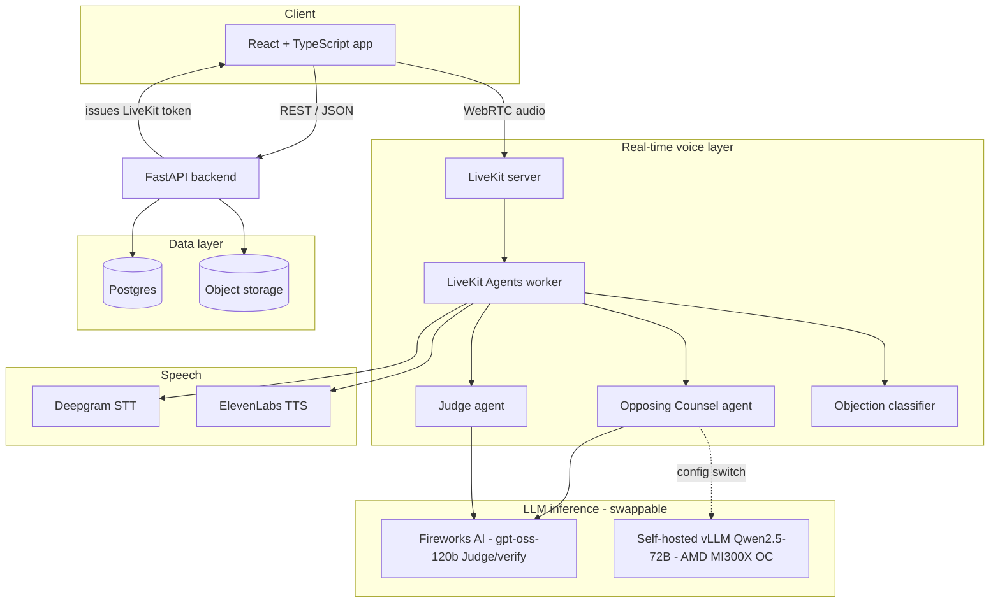
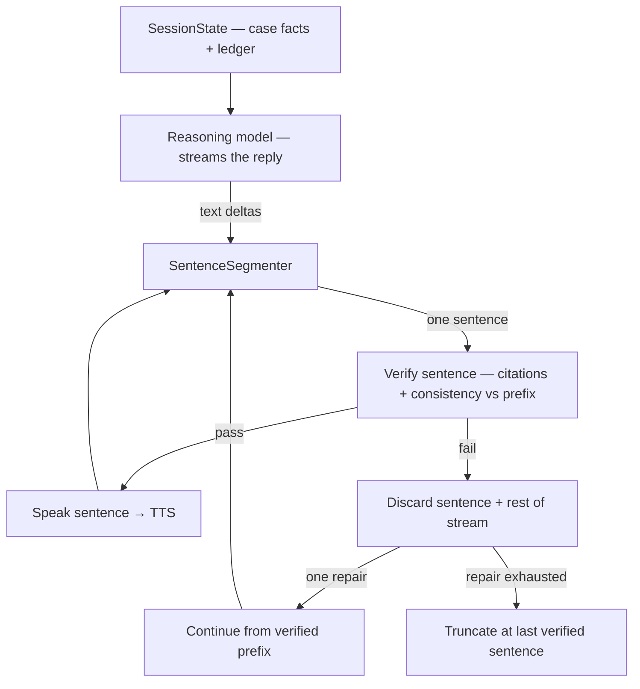

# LexPar AI — Technical Architecture

**Status:** Living document. Update this whenever an architectural decision changes — it is the
single source of truth for the project across chat sessions, contributors, and Claude Code runs.
Pair it with `CLAUDE.md` at the repo root, which should simply point here for full context.

---

## 1. Overview

LexPar AI is a voice-immersive courtroom rehearsal platform for solo and independent trial
lawyers. An attorney speaks their argument aloud against an AI Opposing Counsel that can
interrupt mid-sentence with objections, followed by an AI Judge that delivers a spoken ruling
and a written scorecard.

Built for the AMD Developer Hackathon (Unicorn track), architected to survive past it as a real
product.

---

## 2. Repository structure

Single monorepo. One repo, one source of truth, no cross-repo version drift for a solo build.

```
lexpar-ai/
├── frontend/                    React + TypeScript (Vite)
│   ├── src/
│   │   ├── components/          Shared UI + app shell (AppLayout, UserMenu, Breadcrumbs; ScoreDial, DemoScript, DashboardGuide reviewer aids; shadcn/ui + Tailwind)
│   │   ├── pages/
│   │   │   ├── Login.tsx
│   │   │   ├── Dashboard.tsx         Cases list
│   │   │   ├── CaseUpload.tsx
│   │   │   ├── CaseDetail.tsx        case hub — facts, start session, rehearsal history
│   │   │   ├── Profile.tsx           read-only identity + role
│   │   │   ├── Admin.tsx             Court administration (§13, admin only)
│   │   │   ├── SparringRoom.tsx      LiveKit room UI (live session)
│   │   │   └── Scorecard.tsx
│   │   ├── hooks/
│   │   ├── store/                auth.ts, session.ts (Zustand)
│   │   ├── lib/                  api.ts (REST client), livekit.ts (room client wrapper), flags.ts (VITE_ feature gates), limits.ts (field caps mirror of backend)
│   │   └── App.tsx                routes + auth guard
│   ├── vite.config.ts
│   └── package.json
│
├── backend/                     FastAPI (non-realtime REST API)
│   ├── app/
│   │   ├── main.py
│   │   ├── api/
│   │   │   ├── auth.py           login/register, token issuance, admin bootstrap
│   │   │   ├── cases.py          case CRUD + pleading upload/ingest (§12)
│   │   │   ├── courts.py         court catalog + rule-corpus upload (§13, admin-gated)
│   │   │   ├── sessions.py       session lifecycle, transcript retrieval
│   │   │   ├── scorecards.py     scorecard + ruling-provenance read (§13)
│   │   │   ├── internal.py       agent-token routes (context/knowledge/court-rules/provenance)
│   │   │   └── livekit_token.py  issues LiveKit room access tokens
│   │   ├── models/               SQLAlchemy models (incl. §12/§13: court, court_rule, ruling_provenance)
│   │   ├── schemas/              Pydantic request/response shapes + limits.py (shared field caps)
│   │   ├── security.py           auth deps + destructive-action gate (require_destructive_actions_enabled)
│   │   ├── services/             business logic (case/court knowledge, embeddings, storage, auth, upload_service PDF guardrails)
│   │   ├── prompts/              prompt_loader.py + *.md (pleading summarizer) — backend twin of agents/prompts.py
│   │   ├── db.py
│   │   └── config.py             reads .env
│   ├── alembic/                  schema migrations (through 0006 scorecard criteria, 0007 case profile)
│   ├── requirements.txt
│   └── Dockerfile
│
├── agents/                      LiveKit Agents worker (real-time voice pipeline)
│   ├── main.py                   entrypoint, room join logic
│   ├── opposing_counsel.py       agent persona + prompt
│   ├── judge.py                  agent persona + prompt
│   ├── objection_classifier.py   watches live partial transcript, fires interrupts
│   ├── case_knowledge.py         pleading retrieval (§12); court_knowledge.py = rules retrieval (§13)
│   ├── citation_check.py         turn-scoped citation grounding check (§13)
│   ├── case_posture.py           derives "the matter before the court" at join (DERIVE_MATTER, §6.5)
│   ├── turn_recovery.py          recovers attorney turns the SDK drops mid-utterance (RECOVER_DROPPED_TURNS)
│   ├── stt_keyterms.py           boosts case party names/terms as Deepgram keyterms (STT_KEYTERMS)
│   ├── floor_dynamics.py         natural floor-contest timing (flag-gated FLOOR_DYNAMICS, default off)
│   ├── voice_interrupt.py        objection force-interrupt + cancel-timeout plumbing (§6)
│   ├── session_state.py          per-room shared OC/judge state (keeps rehearsals isolated)
│   ├── llm_router.py             switches Fireworks <-> self-hosted vLLM per agent
│   ├── prompts.py                prompt registry: render()/cache for EVERY LLM prompt (DEV §10)
│   ├── prompts/                  all agent prompt text (personas + sub-task prompts), one *.md each
│   ├── requirements.txt          (+ requirements-voice.txt: heavy media deps, out of CI)
│   └── Dockerfile                voice worker image (deps + model prefetch; prod deploy only)
│
├── scripts/
│   └── seed_court.py             OPTIONAL headless court/rules seeding (§13; NOT the operator path)
│
├── infra/
│   ├── docker-compose.yml        local dev: postgres, minio (local S3), livekit server
│   ├── docker-compose.prod.yml   AMD droplet deployment: full stack + Caddy TLS (additive; §10)
│   ├── livekit.prod.yaml         LiveKit production config (public networking; keys via env)
│   ├── Caddyfile                 reverse proxy: app + /api same-origin, LiveKit WSS domain
│   └── deploy.sh                 idempotent `compose up -d --build` wrapper (droplet-side)
│
├── docs/
│   ├── ARCHITECTURE.md           this file
│   ├── DEVELOPER_GUIDELINES.md   coding conventions, testing baseline, pre-merge checklist
│   └── LESSONS.md                append-only log of past mistakes and their fixes
│
├── .github/workflows/ci.yml      lint + type-check + test; backend image build as a smoke test
├── CLAUDE.md                     points Claude Code here + operational notes
└── .env.example
```

---

## 3. System diagram



Key point encoded in the diagram: **the Opposing Counsel agent's LLM backend is a config switch,
not two code paths.** Both Fireworks and self-hosted vLLM expose OpenAI-compatible endpoints, so
`llm_router.py` just reads an environment variable.

---

## 4. Frontend

**Stack:** React 18 + TypeScript, Vite, Tailwind CSS + shadcn/ui, Zustand (client state),
TanStack Query (server state), `@livekit/components-react` + `livekit-client` (real-time audio).

**Routes:**

| Route | Purpose | Auth required |
|---|---|---|
| `/login` | Login form | no |
| `/dashboard` | Cases list ("Cases" — the authenticated home) | yes |
| `/case/new` | Create a case (title, facts, court) + attach pleading | yes |
| `/case/:id` | Case detail — facts, start a session, rehearsal history | yes |
| `/session/:id` | Live sparring room (LiveKit connection) | yes |
| `/session/:id/scorecard` | Post-session results | yes |
| `/profile` | Profile — read-only identity + role, sign out | yes |
| `/admin` | Court administration (admin only, §13) | yes (admin) |

**App shell & navigation.** All authenticated routes render inside a single shared layout
(`components/AppLayout.tsx`): a topbar with the product name, a primary **Cases** nav item, a
role-gated **Court administration** pill (only when `role === 'admin'`), and a **user menu**
(`components/UserMenu.tsx` → Profile + Sign out). Interior pages (deeper than the Cases list) carry
a consistent **breadcrumb strip** (`components/Breadcrumbs.tsx`, e.g. `Cases › {Case} › Scorecard`)
instead of ad-hoc back buttons. Starting a session and viewing a case's past scorecards both live on
the case-detail page, backed by `GET /api/cases/{id}/sessions`.

### Login form (real password auth)

An actual login form hitting a real endpoint, backed by real bcrypt password auth (§12).

- Form posts `{ username, password }` to `POST /api/auth/login` (the `username` field carries the
  attorney's email — auth is email-based). Accounts are created via `POST /api/auth/register`.
- Backend (see §5) verifies the password against the bcrypt hash in `users.password_hash` and
  returns a signed JWT. The legacy `admin`/`admin` stub was removed at the production cutover — there
  is no demo bypass and no `AUTH_MODE` setting. Both unauthenticated auth routes are **rate-limited**
  (`app/rate_limit.py`: 10/min sliding window per client, keyed on the first `X-Forwarded-For` entry
  because behind Caddy every socket peer is the proxy; in-memory by design — one backend container),
  and register is additionally gated by `ALLOW_REGISTRATION` (routes table, §13).
- Frontend stores the token in memory (Zustand `auth` store) and attaches it as a Bearer token on
  subsequent requests. Not localStorage — keeps it out of persistent browser storage.

The first registrant on an admin-less deployment auto-bootstraps to admin (§13), so Court/rule setup
stays a pure-UI workflow with no script.

### Wiring status (frontend ↔ backend)

The frontend now calls the **real** backend through `lib/api.ts` for auth (login + `/api/auth/me`,
which `ProtectedRoute` uses to validate the session), cases (list/create), session creation,
scorecard retrieval, and — once a session is completed — its persisted transcript. Live voice is
the one thing still absent:

- **Live transcript playback** in `SparringRoom` is still a scripted, timer-driven sequence during
  a session (there is no live STT→LLM→TTS producing turns in real time yet). Starting a session
  still exercises real plumbing: it creates a real `sessions` row (POST /api/sessions) and fetches a
  real LiveKit token (GET /api/livekit/token).
- **Live-audio visualization (`SparringVisualizer`).** The room renders an equalizer for the current
  active speaker plus per-participant presence dots — an additive, `aria-hidden` visual above the
  transcript (the text speaker badge remains the real attribution). The equalizer taps the active
  speaker's LiveKit track via `createAudioAnalyser` (a non-playing `AnalyserNode` — no duplicate
  audio pipeline), swapping the analysed track when the speaker changes; analysis + the single
  `requestAnimationFrame`/`<canvas>` draw loop live in `hooks/useAudioVisualization.ts` (pure math in
  `lib/audioBars.ts`), the context resuming off the existing audio-unlock signal. The dots ride the
  coarse `participant.audioLevel` from `ActiveSpeakersChanged` (no extra analyser). No new npm
  dependency (Web Audio via `livekit-client`); reduced-motion drops to a static frame. Builds on the
  §6.5 active-speaker attribution. While `ocThinking` is set (the `{"type":"oc_thinking"}` boundary,
  below) the wave box is idle and the OC dot is dark — no audio flows yet — so the visual adds a
  peripheral companion to the text badge: a soft red halo breathes around the wave box and the
  Opposing Counsel dot pulses (declarative CSS `animate-oc-pulse`, ~1.6s ease; steady glow under
  reduced motion), filling the silent-composition gap the badge alone is easy to miss during. The
  presence-dot role colors (blue = You, red = Opposing Counsel, amber = Judge) are a shared identity:
  `TranscriptLine` reuses them as a leading speaker dot + role-tinted bubble border so the transcript
  and this visual read as one system. The idle status badge reflects mic state — a live green pulse +
  "Listening" when the mic is hot, "Muted" when it isn't (it no longer misleadingly reads "Listening"
  while muted).
- **Session-end verdict finale (`SessionFinale`).** On "End session" the room stays connected while
  the judge composes and speaks the closing ruling (the §6.5 handshake — the browser only navigates
  once `end_complete` arrives, *after* the ruling has played). That window is no longer a dead spot:
  `SparringRoom` renders a judge-focused finale — **AWAITING** (a slow amber "deliberation" wave
  during `assess_session`'s dead air) → **RULING** (the same equalizer reacting to the Judge's live
  track) — before the Scorecard. Frontend-only, driven by existing signals (`ending` +
  `activeSpeaker==='judge'`/`judgeSpeaking`, with a `hasSpoken` latch); pure phase machine in
  `lib/rulingPhase.ts`, reusing `useAudioVisualization` (`idleStyle:'deliberating'`). The Scorecard's
  own not-ready polling is unchanged (a later, post-navigation backstop).
- **Completed sessions render real data.** When the agent worker (or `session_end_harness.py`) posts
  `complete` + `scorecard`, the session goes `completed` and the persisted scorecard + transcript are
  written. `Scorecard.tsx` then renders the **real** score (as a color-banded `ScoreDial` radial
  gauge — red <50 / amber 50–74 / green ≥75, so a 42 and a 91 no longer look identical), a
  **Performance breakdown** of the judge's four rubric dimensions as per-criterion bars (from the
  scorecard's `criteria` — omitted when empty), colored strengths/weaknesses, and the verbatim
  judge ruling (GET `/api/sessions/{id}/scorecard`), plus a **Transcript** section built
  from the real persisted turns (GET `/api/sessions/{id}`, reusing `TranscriptLine` with the
  objection styling). Multi-line strengths/weaknesses use `whitespace-pre-line` so the per-fact and
  per-objection bullet lines survive. Verified end-to-end offline via the harness (Gap 5).
- **Before a scorecard exists** (session still `in_progress`), GET scorecard returns 409/404 and the
  frontend shows an honest "not available yet" fallback rather than fabricating a score.
- **No dedicated ledger/verification UI.** SessionState's ledger (established facts, objections) and
  the verification pass already flow into the scorecard's score/strengths/weaknesses; they are not
  surfaced as a separate section (deliberately — see Gap 5 in tasks/PLAN.md).

---

## 5. Backend (FastAPI)

| Method | Path | Description | Auth |
|---|---|---|---|
| POST | `/api/auth/register` | Self-service signup — bcrypt hash, first registrant → admin (§12/§13). **Gated by `ALLOW_REGISTRATION`** (default true; set false on public deployments once accounts exist → 403, login unaffected) | no |
| POST | `/api/auth/login` | Verifies password against the bcrypt hash, issues JWT | no |
| GET | `/api/auth/me` | Returns current user from token (incl. `role`) | yes |
| POST | `/api/cases` | Create a case (optional `court_id`, §13) | yes |
| GET | `/api/cases` | List attorney's cases | yes |
| GET | `/api/cases/{id}` | Case detail | yes |
| POST | `/api/cases/{id}/documents` | Upload a pleading PDF → ingest (§12) | yes |
| GET | `/api/cases/{id}/documents` | Pleading ingestion status (§12) | yes |
| GET | `/api/cases/{id}/sessions` | A case's sessions (rehearsal history), newest first | yes |
| GET | `/api/courts` | Active court catalog (case-creation dropdown; §13) | yes |
| POST | `/api/courts` | Create a court (§13) | **admin** |
| POST | `/api/courts/{id}/rules` | Upload an official rule PDF → ingest (§13) | **admin** |
| GET | `/api/courts/{id}/rules` | Rule documents incl. archived (admin corpus surface, §13) | **admin** |
| POST | `/api/courts/{id}/rules/{doc}/replace` | Atomic Replace: supersede on successful ingest (§13) | **admin** |
| DELETE | `/api/courts/{id}/rules/{doc}` | Archive a rule document (soft; out of retrieval) | **admin** |
| POST | `/api/courts/{id}/rules/{doc}/restore` | Un-archive (409 while superseded by a live replacement) | **admin** |
| GET | `/api/courts/{id}/rules/{doc}/impact` | Pre-purge warning: rulings citing this document | **admin** |
| POST | `/api/courts/{id}/rules/{doc}/purge` | PURGE: chunks + row + stored file, gone | **admin** |
| POST | `/api/courts/{id}/archive` | Retire a forum (cascades soft-archive to its documents) | **admin** |
| POST | `/api/courts/{id}/purge` | PURGE a forum (409 while any case references it) | **admin** |
| DELETE | `/api/cases/{id}` | Archive a case (soft, owner default) | yes |
| POST | `/api/cases/{id}/purge` | PURGE a case + everything under it | **admin** |
| DELETE | `/api/cases/{id}/documents/{doc}` | Archive a pleading (soft; out of retrieval) | yes |
| POST | `/api/cases/{id}/documents/{doc}/replace` | Atomic Replace for a corrected pleading | yes |
| POST | `/api/sessions` | Start a session — **`proceeding_type` required** (§13) | yes |
| GET | `/api/sessions/{id}` | Session status + transcript | yes |
| GET | `/api/sessions/{id}/scorecard` | Scorecard after session ends | yes |
| GET | `/api/sessions/{id}/provenance` | Ruling-provenance audit trail for the owner (§13) | yes |
| GET | `/api/livekit/token` | Issues a LiveKit room access token for the frontend | yes |
| GET | `/api/sessions/{id}/context` | (internal) Case facts + `case_summary` + `court_id` + `proceeding_type` at room join | agent token |
| GET | `/api/sessions/{id}/knowledge` | (internal) Pleading retrieval — summary + top passages + chunk ids (§12) | agent token |
| GET | `/api/sessions/{id}/court-rules` | (internal) Court-rules retrieval — passages + chunk ids (§13) | agent token |
| POST | `/api/sessions/{id}/complete` | (internal) Mark session completed | agent token |
| POST | `/api/sessions/{id}/scorecard` | (internal) Write scorecard + full transcript batch at session end | agent token |
| POST | `/api/sessions/{id}/provenance` | (internal) Write one ruling's provenance row (§13) | agent token |

FastAPI does not touch real-time audio at all — that's entirely the LiveKit Agents worker's job.
FastAPI's role is auth, case management, and persisting the results the agents worker produces.

**Internal (agent) routes vs. user routes.** The `agent token` routes above — the worker reads the
case context + knowledge at room join / per turn and writes the results at session end — are
authenticated with a **scoped service credential** (`X-Agent-Token` header, `AGENT_SERVICE_TOKEN`), a
*separate mechanism* from user JWT login (`app/security_agent.py`, not `app/security.py`). Least
privilege (DEV_GUIDELINES §7): the agent token grants only these routes and nothing user-facing; a
user JWT does not grant them. The scorecard write **batches the whole transcript in one call** (no
per-turn round-trips inside the live voice loop). Note `/sessions/{id}/provenance` exists as **both**
an agent-token POST (the worker writes it) and a user GET (the owning attorney reads it) — same path,
distinct method + auth mechanism. The **admin** routes (§13) use a third check, `require_admin` (a
user JWT whose `role == 'admin'`), distinct from both the agent token and an ordinary user JWT.

---

## 6. Real-time voice layer (LiveKit)

- **LiveKit server**: self-hosted (open-source, Apache-2.0), runs in Docker locally and on the
  AMD droplet in production. Can migrate to LiveKit Cloud later without touching agent code.
- **LiveKit Agents worker** (`agents/main.py`, implemented): Deepgram streaming STT → Opposing
  Counsel (Fireworks, via `opposing_counsel.py`, **streamed**) → sentence-level verification
  (§6.5, `streaming_verify.py` — TTS starts on the first verified sentence while the rest is
  still generating) → ElevenLabs **Flash** TTS, with Silero VAD + turn detection. Interim transcripts feed the objection classifier; a `fire`
  decision **barges in** (`session.interrupt()` + an immediate short "Objection — <type>." via the
  tested `voice_interrupt.py` glue). `opposing_counsel.py` / `judge.py` / `verification.py` are used
  verbatim — main.py only wires the audio layer around them. Heavy voice deps live in
  `agents/requirements-voice.txt` (out of CI). **The real audio path — room join, mic→STT, TTS
  playback, VAD, barge-in timing — is only verifiable in a live room with a microphone.**
  - **Prompt registry (`prompts.py`).** Every LLM prompt in the worker — the two personas AND the
    sub-task system/instruction prompts (objection classifier, quick ruling, session assessment,
    consistency verifier) — is one `prompts/*.md` file loaded through `prompts.render(name, **vars)`
    (process-lifetime cache, `warm_cache()` at startup; `string.Template`, not `str.format`, so
    literal JSON braces survive). The pleading summarizer has a separate backend twin
    (`backend/app/prompts/`). Constraint sections are immutable by convention — `render()` never
    takes constraint text as a parameter — so a future prompt-customization layer structurally can't
    reach a no-fabrication rule; the real enforcement stays code-side (`citation_check`). Full
    convention + safety boundary: DEVELOPER_GUIDELINES §10.
  - `opposing_counsel.py` — cross-examines, objects, counter-argues.
  - `judge.py` — monitors the session, delivers rulings.
  - `objection_classifier.py` — **the custom, differentiating piece** (implemented). Watches the
    live partial transcript and decides, in real time, when Opposing Counsel should interrupt and
    with what objection type, following opposing_counsel.md's "only when genuinely invited — not
    every turn" rule. **Three tiers** so it runs continuously *and* barges in at courtroom speed:
    (1) a cheap, **recall-biased regex gate** (`candidate_grounds`, runs on every fragment; no
    candidates → no LLM call); (2) a **precision-biased high-confidence gate**
    (`high_confidence_grounds`) — for phrasing so unambiguous (explicit leading tag-questions,
    direct "he told me" hearsay) that it **fires immediately with no LLM call at all**, the only way
    to hit ~0.5 s barge-in given the account has no sub-second model; (3) the fast model
    (`classify_fragment`, gpt-oss-120b JSON) judges the remaining **ambiguous** candidates.
    On top of the three tiers there is a **supplementary route into tier-3 — the comparative-grounds
    fallback** (not a fourth tier; a different way to *reach* the model): the comparative grounds
    (`relevance` / `mischaracterizes_record` / `assumes_facts`) are judged against the record, not
    surface phrasing, so they have no tier-1 regex and a purely irrelevant/record-mischaracterizing
    statement would be gate-rejected before the model ever saw it. So on a **completed Deepgram
    final** (never interims — those stay cheap at the regex gate), in an **argument proceeding**
    (`oral_argument` / `motion_hearing`, where no witness-examination ground is eligible — derived
    from `eligible_grounds_for`, not hardcoded) that clears a short **length floor**, a final with no
    eligible regex candidate is routed to tier-3 anyway on the eligible comparative grounds. It reuses
    the tier-3 machinery verbatim (fail-closed, eligible-guard) and rides the same
    `consider()`-level debounce/cooldown/hold; only the entry is new. Its fires/no-fires carry their
    own audit outcomes (`fallback_fire` / `fallback_no_fire`) so the route is separately reviewable.
    **Restraint in argument proceedings (two halves).** A live pass showed OC over-objecting in oral
    argument — objecting mid-clause and on ordinary legal argument ("as a matter of law the court
    must find X"). Two coordinated fixes: **(timing)** in argument proceedings (oral_argument /
    motion_hearing) the classifier evaluates only **completed statements** (Deepgram finals) — every
    interim defers, so it never barges in mid-clause and the model judges the whole statement; witness
    examinations keep interim barge-in (cut off an improper question as it's asked). **(judgment)**
    the tier-3 prompt is proceeding-aware: arguing the law and characterizing the record is *proper*
    in argument, so objections there are rare — "as a matter of law the court should find X" is
    advocacy, not `calls_for_legal_conclusion`; the comparative grounds usually don't apply and their
    fallback candidates are framed as "usually none does, default to not firing." (The heavier
    comparative reasoning pushed the classifier's `max_tokens` floor up — raised 512 → 1024 to avoid
    the gpt-oss empty-content bug; it's a ceiling, so simple cases still stop early. See LESSONS.)

    **The judge must share that proceeding lens (the ruling side of the same coin).** The classifier
    being proceeding-aware is not enough: whatever objection *does* fire is handed to the judge, and if
    the judge rules blind it reflexively **sustains** — a live oral-argument pass came back all-
    `sustained` because the quick-ruling prompt received no proceeding type and no instruction to test
    merit, so proper argument ("ultra vires as a matter of law," "demand futility") was objected as
    `assumes_facts` and rubber-stamped. Fix: the proceeding type is now injected into **both** judge
    context builders (inline `quick_ruling` and end-of-session `assess_session`), and both prompts
    (`judge_quick_ruling`, `judge_assessment`/`_expressive`) rule **on the merits** — in an argument
    proceeding, arguing the law / drawing inferences / characterizing the record is *proper*, so
    `assumes_facts` / `calls_for_legal_conclusion` / `argumentative` objections are **overruled** unless
    the statement genuinely misstates an established fact or strays from the issues; witness
    examinations apply the ordinary evidentiary grounds. This is what produces a realistic sustained/
    overruled **mix** instead of an all-sustained bench. See LESSONS.

    `ObjectionClassifier` adds **per-utterance debounce** (compared on **normalized** text — STT
    finals rewrite casing/punctuation relative to their interims, so an exact-prefix check re-arms
    on the revised final and double-fires; see LESSONS), a **re-fire cooldown** (time floor ~5 s,
    injectable clock), and a **ruling hold** (`hold()`/`release_hold()`): while an inline judge
    ruling is in flight no new objection can fire over the judge, and re-arming requires BOTH the
    floor elapsed AND the hold released — so a slow ruling call (network jitter) stays protected.
    The LLM stage **fails closed** (any error → no interruption). Eight audit outcomes distinguish
    `fire_immediate` (tier 2, no model) from `fire` (tier 3, model-judged) and both from
    `fallback_fire` / `fallback_no_fire` (the comparative-grounds route), so an over-aggressive
    high-confidence gate or fallback is visible in the data. `consider()` is **lock-serialized** — the worker
    feeds interim transcripts through it from concurrent `asyncio.to_thread` calls, so its debounce
    state must not be raced. Bespoke logic on top of the framework, not something LiveKit provides
    out of the box.
  - `llm_router.py` — reads `OPPOSING_COUNSEL_LLM_PROVIDER` / `JUDGE_LLM_PROVIDER` env vars and
    points each agent at the correct OpenAI-compatible endpoint.
- **Browser client** (`frontend/src/hooks/useSparringRoom.ts`): connects with the per-session token,
  publishes the mic, and plays the agent's audio. Resilience baked in: LiveKit's built-in
  auto-reconnect covers transient drops (surfaced as a `reconnecting` state); a **terminal
  `Disconnected`** is surfaced and logged rather than left as a dead-but-"live"-looking view; audio
  playback blocked by the **browser autoplay policy** exposes an "enable audio" affordance
  (`room.startAudio()` on a user gesture) instead of the agent being silently inaudible; on unmount
  the subscribed tracks are `detach()`-ed and room listeners removed, so repeated test sessions
  don't leak tracks, handlers, or connections.

---

## 6.5 Memory & verification

Two things keep the spoken replies trustworthy under real-time pressure: a structured memory of the
session, and a verification pass before anything is spoken.

### Session memory (`SessionState`)

Each active session holds a structured, in-memory `SessionState` (`agents/session_state.py`) — not
just a chat transcript:

- **case_facts** — the immutable facts supplied when the session starts.
- **established_facts** — a ledger of facts established during the session (entered into evidence,
  stipulated, or stated without objection).
- **objections** — a ledger of objections: the grounds, who raised it, and the judge's ruling
  (`pending` → `sustained` | `overruled`).

This lets Opposing Counsel and the Judge reason about *what's actually on the record* instead of
re-deriving it from raw transcript each turn, and it is the ground truth the verification pass
checks against. It lives in memory for the session's lifetime; durable copies persist through the
backend models (`transcripts`, `scorecards`) — the raw ledger is never logged.

### Verification pass (streaming, sentence-level, before TTS)

The reply is **streamed** from the reasoning model and verified **sentence by sentence**
(`agents/streaming_verify.py`) — nothing unverified is ever spoken, but sentence 1 is already
playing while sentence 2 is still generating/verifying. This replaced the original
generate-everything-then-verify design, cutting time-to-first-audio roughly in half (measured:
~8.8–12.7 s → **~4.1–4.5 s**; see §7 latency note). Per completed sentence, two checks:

1. **Fabricated legal citations** — the heuristic checker (`agents/verification.py`) on the
   sentence itself; an LLM/DB-backed check comes later.
2. **Consistency** against `SessionState` — the verifier model sees the *accumulated verified
   prefix + the candidate sentence* (so pronouns have context; since the prefix already passed,
   any new contradiction is the candidate's). Must not contradict `case_facts`,
   `established_facts`, or standing objection rulings.

An incremental `SentenceSegmenter` closes sentences as deltas arrive, with a legal-abbreviation
guard so "Brown v. Board", "347 U.S. 483", "No. 5" never split mid-citation.

**Mid-stream failure (Option B):** the failed sentence *and the rest of its stream* are discarded
(later sentences were generated conditioned on the bad one), and **one repair continuation** is
requested — continue from the already-spoken verified prefix, avoiding the rejected claim — which
is verified the same way. If the repair also fails, the reply **truncates** at the last verified
sentence. A citation hit takes the same failure path as a contradiction. Fail-closed throughout:
a verifier or stream error stops the reply at the last verified sentence; if the *first* sentence
fails twice, the agent stays silent — silence over falsehood.



### Feeding the record during the live session

The ledger only means something if the live loop keeps it current, so the worker writes to it as the
session runs:
- **Case facts** are loaded at room join from `GET /api/sessions/{id}/context` (§5) so `SessionState`
  starts with the real case, not empty.
- **Objections** — when the classifier fires (§6), `voice_interrupt.handle_interim` both
  `record_objection(...)` (pending) and adds a `was_interruption` transcript turn. The turn carries
  the ground's **reason** (`objection_transcript`), so the written record reads "Objection —
  hearsay: out-of-court statement" even though the spoken barge-in stays terse ("Objection —
  hearsay.") for latency.
- **Attorney turns** are committed **once per completed utterance** (the agent's
  `on_user_turn_completed` hook), not once per Deepgram `is_final` — otherwise a single spoken turn
  shreds into a dozen transcript fragments. The classifier still sees every interim. Each turn is
  **timestamped at the instant the attorney STARTED speaking** (captured from the `user_state →
  speaking` signal), not at turn-end — because an objection fires *mid*-utterance and is recorded
  then, so timestamping the attorney turn at turn-end would sort the objection/ruling *before* the
  statement they respond to.
- **Opposing Counsel replies** are recorded in a `finally` around the streamed reply, so a reply
  that gets **interrupted mid-stream** still lands on the record (exactly the verified sentences
  that were voiced) rather than vanishing — the reason OC used to look absent from the transcript.

**Report assembly (`scorecard_builder.coalesce_transcript`).** The raw `SessionState.transcript` is
kept as captured; the end-of-session **report** transcript is derived from it: (1) **ordered by
`spoken_at`** so objections/rulings sit after the statement they respond to (the start-time stamping
above is what makes this correct), and (2) **consecutive same-speaker fragments merged** into one
coherent turn (STT/turn-detection splits one spoken stretch into several) — while discrete barge-ins
(`was_interruption`) are never merged, so each objection stays its own line. The backend persists in
that order and its `transcripts` relationship re-sorts by `spoken_at` on read.

### Inline judge rulings (real courtroom sequence)

When an objection fires and Opposing Counsel's line is spoken, the Judge immediately follows aloud
— "Sustained." / "Overruled — <one short reason>." — before the attorney continues:

- **`judge.quick_ruling`** on the FAST model (the objection classifier's config, gpt-oss class —
  this sits directly in the live conversational path, same latency philosophy as the classifier and
  verification; `max_tokens=1024`, the empty-content floor for this prompt).
- The ruling is applied to the ledger **immediately** (`rule_on_objection`) and the spoken line
  recorded as a judge turn; a `{"type": "ruling"}` data event lets the frontend render it live.
- **The Judge speaks with a distinct voice** (`JUDGE_VOICE_ID`, default "Daniel"): judge lines are
  synthesized on a second ElevenLabs TTS instance and played via `session.say(audio=…)`, so a user
  can tell who's speaking by ear — like a real courtroom.
- **TTS expressiveness — a per-call-site model/settings split.** Both voices carry explicit
  `voice_settings` (`config.{OC,JUDGE}_VOICE_SETTINGS`, `.env`-tunable) — `style` was previously unset
  (flat/monotone); OC's is deliberately modest since it's on the latency-critical streaming path. The
  fast model (`eleven_flash_v2_5`) serves OC's live replies and the Judge's `quick_ruling`. The
  Judge's **final ruling only** can optionally use **ElevenLabs v3** with authored **audio tags**
  (`JUDGE_EXPRESSIVE_FINAL_RULING`, off by default) — a second v3 judge TTS instance — because the
  SessionFinale deliberation-wave gives that path real latency slack. Tags are authored via the
  `judge_assessment_expressive` prompt variant and stripped to a **clean** source-of-truth text
  (`audio_tags.strip_audio_tags`) for persistence/display/`citation_check`; the **tagged** text is the
  v3 TTS input only (see LESSONS for the clean/tagged split). v3 stays off the latency-critical paths.
- **Not interruptible** (`allow_interruptions=False`) — you don't talk over the judge; and while the
  ruling is in flight the classifier is on `hold()` (§6), so OC can't object over the judge either.
- **Fail-safe:** on any error/timeout (10 s bound) the judge stays **silent** and the objection
  stays **pending** — the end-of-session assessment rules it; a ruling is never fabricated.
- **No redundant re-argument (object → rule → continue):** on a turn where an objection fired, the
  end-of-turn full `generate_reply` (`llm_node`) is **skipped** — OC already objected and the judge
  already ruled, so a second full argument would be redundant, re-object *after* the ruling, and
  race it through the TTS queue. The full reply still runs on turns with no objection (normal
  cross-examination). Tracked by a per-turn `objected` flag set on fire, checked/reset in `llm_node`.
- **OC's counter-argument is NON-INTERRUPTIBLE (the courtroom floor model).** `OpposingCounselAgent`
  is constructed `allow_interruptions=False`, so once OC begins its end-of-turn reply the attorney's
  VAD can't cut it — exactly like the canned objection and the judge. This was the **single root
  cause of silent OC lines**: OC's reply is the only agent speech VAD could cut, its first audio is
  delayed by generation latency (72B + per-sentence verification + TTS first-byte), and the attorney
  naturally filled that ~3–5 s gap with speech that cancelled OC before a frame played (6 cut-offs
  in one 2-min session). The model now mirrors a real courtroom: the attorney has the floor to
  argue; OC interrupts only via **objections** (the explicit `session.interrupt(force=True)` path —
  `force` is REQUIRED: a plain interrupt RAISES on non-interruptible speech per the SDK, so the
  objection must forcibly take the floor to cut a mid-reply OC, see LESSONS);
  when OC gives its counter-argument the attorney waits. A `{"type":"oc_thinking"}` boundary
  published around generation drives an "Opposing counsel responding — please hold" cue that bridges
  the silent composition gap (the moment the attorney used to talk into). This makes floor dynamics
  (§ below) largely dormant — the attorney can no longer cut OC off — so `FLOOR_DYNAMICS` can be off.
- **One objection channel, not two (the word "objection" ⇒ a ruling).** Objections come ONLY from
  the structured barge-in (the classifier fires → ledger → the judge rules). OC's end-of-turn spoken
  reply is **counter-argument only** and must never lodge a formal objection or say "objection" /
  "I object" — its persona + `oc_reply_style` forbid it, and `llm_node` logs a warning if a reply
  slips one through (observability, never rewritten). Before this, OC (the reasoning model) also
  *verbalized* objections inside its argument (`was_interruption=false` turns), which never entered
  the ledger and so were **never ruled** — a live oral-argument pass showed OC "objecting" 4× in
  spoken argument with the judge ruling only the 1 structured barge-in. The invariant now holds:
  every "Objection" the attorney hears is structured and gets a bench ruling; unruled objection
  language in argument is a prompt-adherence bug, surfaced in the logs.
- **Latency:** the canned objection is on the immediate path (gate ≈ 23 µs, ElevenLabs `/stream`
  first-audio-byte ~0.14 s measured); it fires on an **interim**, so Deepgram endpointing is not in
  this path. `voice_interrupt` logs the gate-decision + interrupt/say-dispatch times per fire. The
  ruling's `quick_ruling` generation is started **concurrently** with the canned line's playback
  (not serialized after it), so the "Sustained/Overruled" lands ≈ max(canned, ~1.3 s) after the
  objection rather than the sum — its `say` still enqueues after the canned line (queue order).
- **Live written transcript:** beyond the objection/ruling events, the worker publishes a
  `{"type":"transcript", speaker, content, timestamp}` event on each **committed speech turn** —
  the attorney's statement (`on_user_turn_completed`, timestamped at speech START), OC's
  counter-argument (`llm_node` finally), and the judge's order line — via `main.publish_transcript`.
  The barge-in objection and inline ruling are NOT re-sent (they already ride their own events, so
  both would double-render); the **closing ruling IS published** (it's spoken during the finale but
  previously appeared as text only in the saved report). The frontend (`useSparringRoom`)
  accumulates all of these into ONE transcript list ordered by **when each line was spoken**
  (`insertByTime`, stable on ties) — matching the saved report's ordering: attorney turns are
  timestamped at speech START but arrive at turn END, so arrival order rendered an objection above
  the statement it interrupted (seen live). Rendered through the existing `TranscriptLine` in the
  sparring room — replacing the old placeholder, so the screen shows the argument as text in real
  time, not just objection bubbles. Related report-side fix: `coalesce_transcript` merges
  **attorney fragments only** — consecutive judge/OC turns are distinct complete utterances, and
  merging them swallowed the closing ruling into the last inline ruling (one giant bubble).
- **Duplicate render guard:** objection/ruling/transcript events carry a stable `timestamp`; the
  frontend dedups on `type:key` using a set held in a **ref** (shared across effect re-runs), so a
  redelivered packet or a double-registered listener can't double-render one line.
- **Speaker attribution (by construction):** the Judge is a **real second room participant** —
  the worker mints a publish-only token locally (identity `judge`, `judge_participant.py`) and
  joins over its own `rtc.Room` connection, speaking by pushing judge-TTS frames into a published
  `AudioSource`. The frontend attributes speech **structurally** (`lib/activeSpeaker.ts`: judge
  identity → Judge, other remote → Opposing Counsel, local → attorney) — no synthetic events.
  Judge audio bypasses the OC session's speech queue entirely, so `session.interrupt()`/VAD can
  never cut the judge off (non-interruptibility by construction); ordering vs. the canned
  objection line is enforced by an explicit `wait_for_clear` gate in `voice_interrupt` (no shared
  queue = no implicit serialization). **Fallback:** if the judge participant fails to connect or
  speak, `judge_voice.JudgeVoice` degrades to the previous session-multiplexed path *including*
  the `{"type":"judge_speaking"}` label events — a LiveKit failure never silences the judge.
- **Track warm-up (`judge_participant.prime`):** the judge track is published and given a ~200 ms
  silent frame **at connect**, not lazily on the first ruling. Otherwise the first objection
  publishes a brand-new track and its audio is lost before the browser finishes subscribing +
  autoplay-unlocking it — the ledger/transcript still record the ruling, so the symptom is
  "objection #1 had no *audible* ruling, later ones fine." Priming during the join window makes the
  first ruling audible like the rest (docs/LESSONS.md).
- **Speaking floor (`judge_idle` Event):** the flip side of "judge bypasses the session queue" is
  that nothing stops the judge (own track) and OC (session track) from speaking at once. A shared
  `asyncio.Event` (SET = judge idle) closes that gap: `judge_rule` and the closing ruling **clear**
  it around the bench's speech (always released in a `finally`), and OC's `llm_node` **awaits** it
  before taking the floor. Without it, a ruling on one STT-final and OC's reply to the *next* rapid
  final collided live. The judge always has priority — it's the court; OC waits. Because an
  objection fires on the *same event-loop tick* the turn completes, `llm_node` also does a brief
  **settle-and-recheck** (`_OC_REPLY_SETTLE_S`) before committing: it yields, then re-tests
  `objected`/the floor, so the objection→`judge_rule` path deterministically wins the race instead
  of OC beating it and streaming a reply the judge then talks over. The floor is also re-checked
  **per sentence** inside the reply loop: a reply that passed the opening gate can be paused by the
  attorney speaking and later resumed (the SDK's sub-threshold pause/resume), and if a ruling
  started in between, an unchecked resume would speak over the judge — the per-sentence gate bounds
  any overlap to audio already buffered.
- **Floor dynamics (flag-gated `FLOOR_DYNAMICS`, default off — `floor_dynamics.py`):** natural
  floor-contest behavior instead of silent turn-taking. When the attorney talks over OC's reply,
  the cut-off is recorded as a **candidate** (with the partial already voiced + the turn it
  answered — OC's prompt is rebuilt fresh each turn, so this IS the retry's memory) and promoted
  only when the interrupting speech becomes a **committed attorney turn**; the SDK's
  `agent_false_interruption` vetoes it, so an echo can never trigger the dance. On the next turn OC
  asks for the floor ("Your honor, may I be heard?" — canned, unverified, no factual claims) and
  *completes the interrupted point* via a `cutoff_note` in its prompt; **one retry per point**. At
  2 corroborated cut-offs the **judge intervenes instead** ("Counsel, you will allow opposing
  counsel to be heard." — spoken holding the judge floor, recorded as a judge turn, never touching
  the objection ledger so rulings/scorecard are unaffected), with a 3-minute cooldown. A structured
  objection **supersedes** the courtesy dance (object → rule → continue). All decisions log
  distinct lines (`cut-off candidate` / `floor request` / `judge order intervention`) for live
  auditing; `FLOOR_DYNAMICS=false` restores byte-identical behavior.
- **The matter before the court (`SessionState.matter`, flag-gated `DERIVE_MATTER`, default on —
  `case_posture.py`):** a real oral argument has a *known* matter — the motion/petition/question and
  the competing positions — before anyone speaks. The agents used to lack it: OC was told to
  "counter-argue with the strongest opposing position given the case facts" and re-derived a stance
  every turn, so on a thin opening (a recited case number, a pleasantry) it **invented a dispositive
  side** ("the petition should be dismissed") — possibly the wrong one, since nothing said which side
  the attorney was on. Fix: once at room join, `case_posture.derive_matter` frames the matter from
  the pleading summary + case facts + proceeding type (one call on the JUDGE/reasoning config — the
  frame steers every stance and ruling all session, so its quality outranks the one-time join
  latency; best-effort, fail-safe to empty) into `SessionState.matter`, surfaced at the top of
  `snapshot()` so **both** OC and the judge share one case-grounded frame. The matter is also
  **published to the frontend** (`{"type":"matter"}` → a "Matter before the court" banner above the
  live transcript): a mis-framed matter silently skews every OC stance and ruling (live, a
  mis-frame produced a bogus relevance sustain against the case's core issue), so the frame must be
  visible, not guessed at. OC is now told to oppose *the attorney's* position on that matter —
  correct by construction, defined relative to what the attorney actually argues — and, when the
  attorney has not yet staked a position, to **press for the basis** rather than invent one; the
  judge rules and assesses against the matter and the relief sought, and won't presume a matter that
  was never argued. `DERIVE_MATTER=false` restores per-turn reasoning from the summary + exchange.
- **The case profile — user-stated ground truth (migration 0007).** The pleading carries the
  substance, but the agents were GUESSING at exactly what broke live: party names (STT mishears),
  the case number ("assumes facts" misfires on the caption), the matter frame, and which side the
  attorney is on (OC inventing a stance). Case creation now captures a structured profile — case
  number, petitioner, respondent, **which side the attorney represents**, and the **relief
  sought** — flowing DB → `/context` → `SessionState` → a `CASE PROFILE (…authoritative)` block
  atop every `snapshot()`. Effects: the caption is ON THE RECORD from second zero (the
  empty-record opening can no longer make the case's own background an "unestablished fact"); OC's
  side is fixed **by declaration** (persona: the profile assignment is authoritative; the
  matter-inference path remains the fallback for pre-profile cases); the matter derivation leads
  with the profile (a pleading's differing emphasis can no longer mis-frame it); and the
  user-stated parties/number/relief lead the STT keyterm sources. All fields nullable/optional —
  pre-profile cases behave exactly as before.
- **OC may decline the floor (the PASS sentinel).** The loop generates an OC reply after every
  attorney turn, so OC used to manufacture commentary even for a housekeeping opening (reading the
  case caption) — real opposing counsel does not rise when the case is being called. The model
  decides: when a turn calls for no response (housekeeping, a pleasantry, an incomplete fragment),
  it replies with the bare sentinel `PASS` (oc_reply_style, byte-goldened) and
  `opposing_counsel.is_pass` (full-sentence match — "Passing over that…" is never swallowed) turns
  it into silence in `llm_node`: nothing spoken, nothing recorded, floor dynamics treats it as a
  natural ending, logged at INFO ("OC declined the floor").
- **The bench owns the floor — outright.** The `judge_idle` gate keeps OC from *starting* a reply
  over a ruling, but audio already buffered keeps playing — a stress test (attorney talking over
  everyone) showed a late inline ruling overlapping OC's in-flight reply for seconds. Both the
  inline ruling and the closing ruling now `session.interrupt(force=True)` immediately before the
  judge speaks (after the canned objection line clears), like a real courtroom: when the bench
  speaks, everyone stops. Best-effort (nothing to interrupt → no-op).
- **Dropped-turn recovery (flag-gated `RECOVER_DROPPED_TURNS`, default on — `turn_recovery.py`):**
  the SDK DISCARDS a user turn that completes while non-interruptible agent speech is playing
  (`skipping reply to user input…`, returned before `on_user_turn_completed` — verified in the
  installed SDK). With OC non-interruptible that meant whole attorney arguments vanished: not in the
  record, not in OC's context (OC pressed the same point repeatedly — starvation, not a prompt bug),
  not in the live view, while objections fired on the interims dangled unanchored. Every STT final
  is buffered; the next committed turn reconciles the buffer (its own finals are covered by the
  committed text) and the leftovers — the dropped turn — are committed and published with their
  original stretch-start timestamps; a session-end drain completes the record before the judge's
  assessment. See LESSONS (2nd casualty of OC non-interruptibility).
- **Case-aware STT vocabulary (flag-gated `STT_KEYTERMS`, default on — `stt_keyterms.py`):** this
  case's party names/entities (deterministically extracted from the case title, facts, and pleading
  summary — no LLM, no hardcoded vocabulary) are passed as Deepgram nova-3 `keyterm` boosts.
  Live, STT mangled exactly these terms ("TCT"→"VLT", "SARC"→"SIRC") and OC/the classifier argued
  faithfully from the misheard words — indistinguishable from hallucination in the transcript.
  nova-3-only (the plugin raises otherwise); no terms → the STT runs unboosted as before.
- **Conversation memory (`SessionState.recent_exchange`):** `snapshot()` deliberately holds only
  the durable record (facts + ledger), so per-turn prompts were rebuilt **amnesiac** — OC could
  not see its own prior replies (it repeated the same sentence across five turns live) and the
  inline judge ruled on a fragment with no view of the exchange. `recent_exchange(max_turns=10,
  max_chars=2000)` renders the last turns speaker-labelled, oldest first, char-capped; it rides in
  OC's reply + continuation contexts (with an explicit do-not-repeat instruction) and the judge's
  quick-ruling context. Empty transcript → no block, so offline harnesses are byte-identical.
- **Turn pacing (the fragmentation fix):** Deepgram's plugin default endpointing is **25 ms** — a
  mid-sentence breath finalized the turn, shredding one spoken argument into 3-4 turns that OC
  answered individually. Three env-tunable knobs (no rebuild): `DEEPGRAM_ENDPOINTING_MS` (300),
  `MIN_ENDPOINTING_DELAY` (0.8 s), `MAX_ENDPOINTING_DELAY` (6 s) — a brief pause continues the
  SAME turn; the semantic turn detector may extend within [min, max]. Tuning guidance in
  `.env.prod.example`. Trade-off: finals gate the argument-proceeding objection fallback, so
  raising endpointing too far delays those objections.
- **Disconnect handling (identity-checked + grace):** `participant_disconnected` finalizes the
  session ONLY for the attorney, and only after a 15 s grace window in which a browser refresh /
  transient drop can rejoin ("Resume session" stays alive). The judge participant's own
  disconnects are ignored — it is the worker's second connection (§6.5), and a blip on it must
  never end a live session. Finalization stays idempotent.

### End-of-session judge assessment (spoken ruling + scorecard)

At session end the Judge makes **one** structured call (`judge.assess_session`) that: rules each
objection **still pending** `sustained`/`overruled`, extracts the 2–5 facts the attorney genuinely
established (→ scorecard **strengths**), **grades the performance 0–100 on a four-part rubric**
(command of the record, responsiveness to rulings, argument structure, procedural discipline) —
returning both the holistic overall score and a 0–100 sub-score per dimension in
`performance_criteria` (→ the scorecard's **Performance breakdown** bars; normalized by
`judge._parse_criteria`, fail-safe to no breakdown) — with
1–3 specific `performance_notes` (→ scorecard **score** and **weaknesses**), and returns the
closing ruling — which **acknowledges the objections already ruled from the bench during the
session** rather than re-ruling them (inline rulings are final). The rubric exists because the old
score (100 − 8 per sustained objection) went hollow once the bench started ruling on the merits:
most sessions scored 100 with an empty Weaknesses box. It **fails safe** twice over: on an
unparseable/empty model response, objections stay pending (not sustained → the attorney is never
penalized on a model glitch), no facts are invented, a neutral closing ruling is used — and a
missing/garbage `performance_score` parses to None, in which case `scorecard_builder`'s original
deterministic heuristic stands, so the scorecard can never come back empty or fabricated. The
transcript block the assessment reads is **capped** (`judge._TRANSCRIPT_MAX_CHARS`, newest turns
kept, explicit omission marker) so a long session cannot blow the prompt at its most important
moment; the durable record (facts + ledger) is always fully present regardless.

**End-of-session handshake (so the judge is *heard*, and the scorecard is ready when the page
loads).** When the attorney clicks "End session", the browser publishes an `end_session` data
message (topic `control`) and waits. The worker's `_finalize_session(speak=True)` runs the
assessment, **speaks the closing ruling aloud** (`session.say`), persists the scorecard + transcript,
then publishes `end_complete` — only then does the frontend navigate to the scorecard (which is now
written). This runs **exactly once** (idempotent guard) with two backstops that finalize *silently*
if the attorney never sends the event: `participant_disconnected` (tab closed) and the job shutdown
callback — so the scorecard always lands rather than waiting on the room's empty-timeout. The
scorecard page also **polls** briefly (≈30 s) on a 409/404 to cover the few seconds the judge call +
persistence take.

### Co-location

Once the reasoning model is self-hosted on the AMD MI300X (§7), the verification model runs **on the
same GPU** as the reasoning model — the check is a local forward pass, not a network hop, so it fits
inside the turn's latency budget. While both run on Fireworks, verification is simply a second API
call.

### Implemented now vs. pending keys

- **Implemented + tested (no keys):** `SessionState` and its update methods; the regex citation
  heuristic (`find_suspicious_citations`).
- **Implemented, live via Fireworks:** the LLM consistency check (`check_consistency`, small
  verification model), Opposing Counsel + Judge response generation (blocking and **streaming**
  via `stream_reply`/`chat_stream`), the sentence-level streaming verification pipeline
  (`streaming_verify.py`), the objection classifier (`objection_classifier.py`, §6), and
  `llm_router` (§7). Live calls are covered by `@pytest.mark.live` tests, excluded from CI.
  Text-only harnesses (`agents/harness.py`, `agents/objection_harness.py`,
  `agents/streaming_harness.py`) exercise the draft→verify path, the streaming interrupt logic,
  and the per-sentence streaming pipeline (with measured before/after latency) without any voice
  infrastructure.
- **Implemented, needs a live room to verify:** the real-time voice worker (`agents/main.py`) —
  Deepgram STT + ElevenLabs Flash TTS + objection barge-in. The livekit-free glue (`voice_interrupt.py`)
  is unit-tested; the actual audio path (mic→STT, TTS playback, VAD, barge-in timing) can only be
  validated in a live LiveKit room with a microphone. Verification model GPU co-location arrives with
  self-hosting (§7).

---

## 7. LLM inference routing

| Agent | Model in use now | Post-droplet option | Why |
|---|---|---|---|
| Opposing Counsel | Fireworks `deepseek-v4-pro` (local dev); **self-hosted `Qwen2.5-72B-Instruct` on AMD MI300X (hackathon droplet, live 2026-07-11)** | Self-hosted vLLM on AMD MI300X | Proves AMD platform ownership for the hackathon; config-only switch (§10.5), so local dev stays on Fireworks unchanged |
| Judge | Fireworks `gpt-oss-120b`, JSON-structured (**interim**) | Stays on Fireworks | **Should be Gemma** for bonus-prize eligibility, but no serverless Gemma (2/3/4) is reachable on this account/endpoint — verified against the live `/v1/models` list and direct ID probes (all 404), including the Gemma 3 12B/4B IDs from Fireworks' changelog. Interim: `gpt-oss-120b` via structured `{"ruling": …}` output (fast, reliable). `deepseek-v4-pro` was rejected for the Judge — as a reasoning model it is slow (30–60s) and intermittently returns empty content. Do not self-host this one. |
| Verification | Fireworks `gpt-oss-120b` | Same GPU as reasoning (self-hosted) | Small/fast verifier per §6.5 — deliberately not the reasoning model; needs clean JSON output. |
| Objection classifier | Fireworks `gpt-oss-120b`, JSON (`OBJECTION_LLM_MODEL`), `max_tokens=1024` | Fast model, co-located | Most latency-sensitive call (streaming speech). **Benchmarked against the whole account catalog** (see note below): gpt-oss-120b is the *fastest reliable* model here (~1.3 s), and `max_tokens` cannot drop below 512 without reproducing the empty-content bug (raised to 1024 once the proceeding-aware calibration made the comparative judgments reason more — a ceiling, so simple cases still stop early). So the latency win came from the **three-tier gate** (§6), not a model swap — clear leading/hearsay fire with no model call at all. Runs only on gate candidates and debounces per utterance. Swap via env if a faster model ever appears. |

Switching is a config change (`.env` value), never a code change — this is deliberate. **Bonus-eligibility
note:** the Judge must move to a Gemma model before relying on Gemma-track eligibility; tracked as an
open item until a serverless Gemma is available on the account.

**Model-latency note:** on the Fireworks/local path Opposing Counsel runs `deepseek-v4-pro` (the
droplet self-hosts Qwen2.5-72B instead — table above) — benchmarked over repeated live
runs at a median ~4s (3.5–7.8s), every run `finish=stop` with non-empty content. Its direct
"generate a rebuttal" task does not trigger the long deliberation that made deepseek slow (30–60s)
and intermittently empty for the Judge's "rule only if warranted" task — which is why the Judge
runs on `gpt-oss-120b` (JSON-structured) instead. Verification uses `gpt-oss-120b` for clean JSON.

**Reply-latency note (streaming, 2026-07-09).** Streaming sentence-level verification (§6.5)
measured live against the old blocking path (full `generate_reply` + one whole-reply
`check_consistency`): time to first verified sentence **8.8–12.7 s → 4.1–4.5 s** (54–65% faster)
over repeated runs. The remaining first-audio cost is deepseek's time-to-first-sentence (~2.5–3 s)
plus one short verify (~1.3 s) — the next lever is a faster/streaming-friendlier Opposing Counsel
model once self-hosted on the MI300X, plus the co-located verifier (§6.5 co-location).

**OC brevity (2026-07-12).** A live pass showed OC replies too long *and* slow to finish. OC is now
capped at `_OC_REPLY_MAX_TOKENS = 140` (down from 400) and the `oc_reply_style` prompt demands ONE
or TWO punchy sentences — fast verbal sparring, not a brief. Shorter replies cut both the
generation and TTS-playout time and stop OC monologuing. Note the *objection* path is separate: in
argument proceedings every ground is LLM-judged (`decide` ~3 s, the comparative fallback), so
objections there are inherently slower than a witness examination, where `leading`/`hearsay` fire at
the ~23 µs regex gate with no model call — direct/cross is the snappier objection showcase.

**Objection-classifier benchmark (2026-07-08).** All account chat models were timed on the
classifier's actual task (short structured JSON, temp 0, N=7): `gpt-oss-120b` med **1.26 s** (7/7
`stop`, parseable) — the fastest *and* most reliable. deepseek-v4-pro 3.42 s; glm-5p1 7.86 s;
glm-5p2 10.76 s (never fired); kimi-k2p5 500-errored; kimi-k2p6 6.56 s (4/7 parse). **The account
has no sub-second / non-reasoning model** — the model lever is exhausted. Lowering gpt-oss
`max_tokens` below 512 reproduces the documented empty-content bug (mt=128/64/48/32 → `finish=length`,
0/7 non-empty) for only ~0.3 s of savings, so 512 stays. The barge-in speedup therefore comes
entirely from the tier-2 high-confidence gate (§6), which skips the model on clear cases (measured:
clear leading/hearsay ~1.1–2.1 s → **~0 s**).

---

## 8. Database schema (Postgres)

```sql
CREATE TABLE users (
    id UUID PRIMARY KEY DEFAULT gen_random_uuid(),
    email TEXT UNIQUE NOT NULL,
    full_name TEXT,
    password_hash TEXT,             -- bcrypt hash (real auth); a NULL hash can never authenticate
    firm_name TEXT,
    role TEXT NOT NULL DEFAULT 'attorney',  -- 'attorney' | 'admin' (§13; first-login bootstrap)
    created_at TIMESTAMPTZ DEFAULT now()
);

CREATE TABLE cases (
    id UUID PRIMARY KEY DEFAULT gen_random_uuid(),
    user_id UUID REFERENCES users(id),
    title TEXT NOT NULL,
    case_number TEXT,                -- case profile (migration 0007): user-stated, authoritative
    petitioner TEXT,                 --   parties as machine-readable fields (STT keyterms, matter)
    respondent TEXT,
    represented_party TEXT,          --   'petitioner'|'respondent' — OC takes the OTHER side by declaration
    relief_sought TEXT,              --   what the matter + judge's assessment anchor to
    case_facts TEXT,                 -- optional additional context (pleading is the primary source)
    case_summary TEXT,               -- LLM-extracted pleading digest (§12), always in agent context
    court_id UUID REFERENCES courts(id),  -- §13 forum grounding (nullable at DB; required by new UI)
    storage_path TEXT,               -- object storage key for uploaded file
    created_at TIMESTAMPTZ DEFAULT now()
);

CREATE TABLE sessions (
    id UUID PRIMARY KEY DEFAULT gen_random_uuid(),
    case_id UUID REFERENCES cases(id),
    user_id UUID REFERENCES users(id),
    status TEXT DEFAULT 'in_progress',   -- in_progress | completed | abandoned
    proceeding_type TEXT NOT NULL DEFAULT 'oral_argument',  -- §13: gates eligible objection grounds
    llm_backend_used TEXT,               -- 'fireworks' | 'self_hosted'
    started_at TIMESTAMPTZ DEFAULT now(),
    ended_at TIMESTAMPTZ
);

CREATE TABLE transcripts (
    id UUID PRIMARY KEY DEFAULT gen_random_uuid(),
    session_id UUID REFERENCES sessions(id),
    speaker TEXT NOT NULL,               -- 'attorney' | 'opposing_counsel' | 'judge'
    content TEXT NOT NULL,
    was_interruption BOOLEAN DEFAULT false,
    spoken_at TIMESTAMPTZ DEFAULT now()
);

CREATE TABLE scorecards (
    id UUID PRIMARY KEY DEFAULT gen_random_uuid(),
    session_id UUID REFERENCES sessions(id) UNIQUE,
    overall_score NUMERIC,
    strengths TEXT,
    weaknesses TEXT,
    judge_ruling TEXT,
    criteria JSON NOT NULL DEFAULT '[]',  -- per-dimension rubric breakdown [{name, score}] (migration 0006)
    created_at TIMESTAMPTZ DEFAULT now()
);
```

**Tables defined in their own sections** (kept there to keep this canonical block readable):
`case_documents` / `case_chunks` (pleading RAG) — see **§12**; `courts` / `court_rule_documents`
/ `court_rule_chunks` (rules corpus) and `ruling_provenance` (citation audit trail) — see **§13**.
Migrations: `0001_initial`, `0002_case_knowledge_and_auth` (§12), `0003_court_grounding` (§13
tables + the `role` / `court_id` / `proceeding_type` columns above, with backfills), and
`0004_ruling_provenance` (§13).

## Object storage layout

```
cases/{case_id}/{original_filename}
```

S3-compatible (MinIO locally, DigitalOcean Spaces in production).

### Backend implementation notes (as built)

- **Migrations:** the schema is created and versioned with **Alembic** (`backend/alembic/`), not
  `create_all` on startup. Run `alembic upgrade head` before serving. Tests build the schema from
  `Base.metadata` on SQLite, so CI needs no database service.
- **Portable column types:** models use SQLAlchemy's `Uuid` type and application-side defaults
  (`uuid4`, timezone-aware `datetime.now`) rather than Postgres server defaults
  (`gen_random_uuid()`, `TIMESTAMPTZ`). The same models therefore run unchanged on Postgres
  (prod) and SQLite (tests).
- **Soft deletes → the two-tier deletion design.** `users`, `cases`, `sessions`, and both document
  tables carry a nullable `deleted_at`. This grew into an explicit two-tier model (§13):
  **Archive** (soft, default, reversible — set `deleted_at`; the entity leaves lists AND retrieval
  via the document-state filter, but rows/chunks/files remain, so `RulingProvenance` stays
  resolvable) vs **Purge** (hard, admin-only, typed-confirmation — rows, chunks, and the stored
  object-storage file are genuinely deleted, with a manually-ordered cascade since no FK cascade
  exists). Document tables also carry `superseded_by_id`: the atomic **Replace** action archives
  the old version only after its replacement ingests to `ready`. A retention policy later is
  still a query change, not a schema migration.
- **Sensitive fields** (`cases.case_facts`, `transcripts.content`, scorecard text) are tagged
  `# SENSITIVE: attorney work product` in the models and never logged.
- **Who writes what:** the browser client never writes `transcripts` or `scorecards`. The agents
  worker persists them **once at session end** via the internal routes (§5): `POST .../complete` then
  `POST .../scorecard`, which batch-inserts the whole transcript alongside the scorecard. The user
  routes only read them back.

---

## 9. Environment variables

| Variable | Purpose |
|---|---|
| `DATABASE_URL` | Postgres connection string |
| `OBJECT_STORAGE_ENDPOINT` / `OBJECT_STORAGE_BUCKET` | S3-compatible file storage |
| `LIVEKIT_URL` / `LIVEKIT_API_KEY` / `LIVEKIT_API_SECRET` | LiveKit server connection |
| `OPPOSING_COUNSEL_LLM_PROVIDER` | `fireworks` \| `self_hosted` |
| `OPPOSING_COUNSEL_LLM_ENDPOINT` | OpenAI-compatible URL for whichever provider is active |
| `OPPOSING_COUNSEL_LLM_MODEL` | Reasoning model id (default: `deepseek-v4-pro`) |
| `JUDGE_LLM_PROVIDER` | keep as `fireworks` (Gemma bonus eligibility once Gemma is deployed) |
| `JUDGE_LLM_ENDPOINT` | Fireworks endpoint |
| `JUDGE_LLM_MODEL` | Judge model id (default: `gpt-oss-120b`, JSON-structured; move to Gemma once a serverless Gemma is reachable — §7, §11) |
| `VERIFICATION_LLM_PROVIDER` / `VERIFICATION_LLM_ENDPOINT` / `VERIFICATION_LLM_MODEL` | Verifier, NOT the reasoning model (§6.5; default `gpt-oss-120b` — swap for a smaller model when deployed) |
| `OBJECTION_LLM_PROVIDER` / `OBJECTION_LLM_ENDPOINT` / `OBJECTION_LLM_MODEL` | Objection classifier — the latency-sensitive streaming call (§6; default `gpt-oss-120b`) |
| `OBJECTION_REFIRE_COOLDOWN_S` | Minimum gap before Opposing Counsel may object again after a sustained/overruled objection — stops objection-on-every-turn (§6). Default **20.0** |
| `FLOOR_DYNAMICS` | Natural floor-contest dynamics (`floor_dynamics` module). Default **off** — the live path is byte-identical until set `true`; one env line rolls it back (same pattern as `ELEVENLABS_STREAMING`) |
| `FIREWORKS_API_KEY` / `DEEPGRAM_API_KEY` / `ELEVENLABS_API_KEY` | Provider auth |
| `SELF_HOSTED_API_KEY` | Key for any LLM role whose provider is not `fireworks` (self-hosted vLLM per §10.5). vLLM ignores it; default `EMPTY` is a valid placeholder. Resolved by `llm_router.api_key_for()` |
| `DEEPGRAM_MODEL` / `ELEVENLABS_MODEL` / `ELEVENLABS_VOICE_ID` | Voice pipeline (agents/main.py); defaults `nova-3` / `eleven_flash_v2_5` / "George" (premade, free-tier-usable). The droplet overrides `ELEVENLABS_VOICE_ID` to Asher (`UaYTS0wayjmO9KD1LR4R`) for Opposing Counsel |
| `ELEVENLABS_STREAMING` / `ELEVENLABS_AUTO_MODE` | Websocket-streamed TTS + latency-optimized auto mode (§6.5). Both default **on** (paid tier); set `false` to fall back to buffered synthesis |
| `MIN_ENDPOINTING_DELAY` / `MAX_ENDPOINTING_DELAY` | How long the session waits before committing end-of-turn — the pause that lets the attorney finish a thought without being cut off (§6.5). Defaults **0.8** / **6.0** seconds |
| `JUDGE_VOICE_ID` | The Judge's DISTINCT voice (§6.5 inline rulings; default "Daniel") — speakers are tellable apart by ear |
| `INTERRUPTION_MIN_DURATION` | Seconds of attorney speech required to interrupt the agent mid-utterance (§6). Default `1.0` — above the SDK's 0.5 so a brief noise/echo can't cut Opposing Counsel off before it speaks (the VAD false-interruption bug); raise to 1.5-2.0 in a noisy room, lower if interruptions feel unresponsive |
| `{OC,JUDGE}_VOICE_{STABILITY,SIMILARITY_BOOST,STYLE,USE_SPEAKER_BOOST}` | ElevenLabs `voice_settings` expressiveness (§6.5). `style`=0 reverts to flat delivery; tune by ear |
| `JUDGE_EXPRESSIVE_FINAL_RULING` / `JUDGE_V3_MODEL` | Track B (gated, default off): v3 + audio tags for the Judge's final ruling only (§6.5) |
| `DERIVE_MATTER` | Frame "the matter before the court" at room join (`case_posture.py`, §6.5) — the shared OC/judge posture. Default **on**; `false` rolls back to per-turn reasoning from the case summary + exchange |
| `RECOVER_DROPPED_TURNS` | Recover attorney turns the SDK discards during non-interruptible speech (`turn_recovery.py`, §6.5). Default **on**; `false` restores the lossy behavior |
| `STT_KEYTERMS` | Boost this case's party names/terms as Deepgram nova-3 keyterms (`stt_keyterms.py`, §6.5) — capitalized entities first, then recurring lowercase case vocabulary ("ultra vires"). Default **on**; `false` runs STT unboosted |
| `INTERRUPT_CANCEL_TIMEOUT_S` | Cap on the interrupted-speech wind-down before hard cancel (patches the SDK's 5.0s `INTERRUPTION_TIMEOUT`; main.py). An objection's force-interrupt awaits this wind-down before the canned line can start — measured up to ~5.3s of objection latency. Default **1.5**; `<= 0` leaves the SDK default |
| `JWT_SECRET` | Token signing — **required, ≥ 32 chars**; the app refuses to start with a blank/missing/weak key (`openssl rand -hex 32`) |
| _(auth mode)_ | Removed — auth is always real bcrypt password auth; there is no `AUTH_MODE` setting (a leftover value in `.env` is ignored) |
| `CORS_ORIGINS` | Comma-separated browser origins allowed to call the API (e.g. the Vite dev server) |
| `ALLOW_REGISTRATION` | Gate on `POST /api/auth/register` (default `true`). Set `false` after the admin-bootstrap account exists to close public sign-up |
| `MAX_UPLOAD_MB` | Hard cap on PDF upload size, enforced by a streamed byte counter (`upload_service.py`, §7 uploads). Default **25** |
| `DESTRUCTIVE_ACTIONS_ENABLED` | Master gate on archive/purge across the API (`security.require_destructive_actions_enabled`, 403 when off). Default `true`; set **`false`** during the competition so no reviewer can delete data. Mirror on the frontend with `VITE_DESTRUCTIVE_ACTIONS_ENABLED` |
| `AGENT_SERVICE_TOKEN` | Scoped service credential for the agent's internal session-write routes (§5) — NOT user auth. Empty = internal routes locked |
| `AGENT_BACKEND_URL` | (agents worker) Base URL of the backend the worker persists to (default `http://localhost:8000`) |

Never commit `.env` — `.env.example` documents the shape, real values stay local/secrets-managed.

**Frontend env** (all prefixed `VITE_`, the only prefix Vite exposes to the browser; see
`frontend/.env.example`, read via `frontend/src/lib/flags.ts`):

| Variable | Purpose |
|---|---|
| `VITE_API_BASE_URL` | Backend base URL (default `http://localhost:8000`) |
| `VITE_DESTRUCTIVE_ACTIONS_ENABLED` | Client mirror of the backend `DESTRUCTIVE_ACTIONS_ENABLED` gate — hides the Archive/Purge UI when `false` (the API still enforces it; this just stops rendering dead controls). Default off for the competition |
| `VITE_SHOW_DEMO_SCRIPT` | Show the read-aloud reviewer aids (DemoScript on the sparring page, DashboardGuide on the dashboard). Reviewer/demo builds only |
| `VITE_DEMO_CASE_TITLE` | Title of the case that gets the "Start here" marker in the reviewer guide (default the SARC case) |

---

## 10. Deployment

- **Local dev:** `infra/docker-compose.yml` brings up the infra — Postgres, MinIO, and the LiveKit
  server (dev mode, default keys `devkey`/`secret`, and `--node-ip 127.0.0.1` so ICE candidates are
  reachable from the host browser — required on Docker-for-Mac, see LESSONS). The backend, agents,
  and frontend dev server run on the host and point at these via `.env` / `VITE_API_BASE_URL`. Both
  LLM agents point at Fireworks until the AMD droplet exists. Bring it up with
  `docker compose -f infra/docker-compose.yml up -d`; LiveKit answers on `http://localhost:7880`
  (returns `OK`).
- **Apply the DB schema (required first-run step):** a freshly created Postgres has no tables, so
  the first request that touches one (e.g. login → `users`) fails with `relation "users" does not
  exist`. After the infra is up, run the migrations once from `backend/`:
  `alembic upgrade head`. Re-run it after pulling any new migration.
- **Agents voice worker:** the heavy voice deps are separate (`agents/requirements-voice.txt`, out
  of CI). Run it against a live LiveKit server with:
  `pip install -r agents/requirements.txt -r agents/requirements-voice.txt` then
  `python agents/main.py dev`.
- **Production (AMD Developer Cloud droplet):** `infra/docker-compose.prod.yml` runs the full
  stack — Postgres (fresh volume; no local data migrates to the temporary droplet), MinIO,
  LiveKit (production networking: `--node-ip <public IP>`, UDP media range 50000–50060 + TCP 7881,
  real keys via `LIVEKIT_KEYS`; `infra/livekit.prod.yaml`), a one-shot `migrate` service (reuses
  the backend image, `alembic upgrade head`), backend, agents worker (own Dockerfile: both
  requirement sets + model prefetch, `python main.py start`), frontend (multi-stage build → nginx
  SPA; `VITE_API_BASE_URL` baked at build), and **Caddy** as the only public HTTP/S entry
  (`infra/Caddyfile`): auto-TLS via Let's Encrypt on sslip.io domains — the app + `/api/*`
  same-origin on `PUBLIC_DOMAIN`, LiveKit signaling as WSS on `LIVEKIT_DOMAIN` (media flows
  directly over UDP/TCP, not through Caddy). Config comes from a repo-root `.env.prod`
  (gitignored; `.env.prod.example` documents the shape — fresh droplet-only secrets,
  `INTERRUPTION_MIN_DURATION=1.0` set explicitly). Deploy: `./infra/deploy.sh` (idempotent
  `compose up -d --build`), from a stable tag — the droplet does not track `main`. All of this is
  **additive**: local dev (`infra/docker-compose.yml` + host processes) is unchanged. Images build
  on the droplet; CI still pushes nothing to a registry (a build-and-push pipeline remains future
  work). **Backups:** `./infra/backup.sh` dumps Postgres (pg_dump, safe while running) and tars the
  MinIO volume (uploaded PDFs) to `/root/backups`, keeping the newest 14 of each; run it manually
  before any demo and via the cron line documented in the script header. Dumps hold attorney work
  product — on-box root-only; encrypt before ever shipping off-box.
- **CI (`.github/workflows/ci.yml`):** lint + type-check + test on every push, plus a
  `docker build` of the **backend** image as a smoke test (built and locally tagged `:ci`, never
  pushed to a registry — frontend/agents images are deferred). A full build-and-push-to-registry
  pipeline feeding the production pull above is still to be written.

---

## 10.5 AMD Developer Cloud migration runbook (self-host Opposing Counsel on vLLM / MI300X)

The single reason this platform is on the AMD Developer Hackathon is to run inference on AMD
hardware. Today both agents run on Fireworks (§7). This runbook is the **pre-worked cutover** for the
day the MI300X droplet becomes available — so it is executed, not designed, under time pressure. The
cutover itself is a **config change, not a code change** (`llm_router.py` already speaks the
OpenAI-compatible API to whatever endpoint the env vars name).

**Scope:** move **Opposing Counsel** (the reasoning model) to a self-hosted vLLM server on the
MI300X. The Judge stays on Fireworks until a Gemma model is available (§7, §11). Verification can
follow Opposing Counsel onto the same GPU as a second step (co-location, §6.5).

### Step 0 — Before the droplet exists (do this now, once)

- [ ] Decide the candidate open model for Opposing Counsel and record it here (see Step 3). Having the
      model id chosen in advance is what makes the cutover minutes, not hours.
- [ ] Confirm the switch points are only env vars: `OPPOSING_COUNSEL_LLM_PROVIDER`,
      `OPPOSING_COUNSEL_LLM_ENDPOINT`, `OPPOSING_COUNSEL_LLM_MODEL`, and `SELF_HOSTED_API_KEY`
      (`agents/config.py`). No code path is provider-specific — `llm_router.api_key_for()` already
      returns `SELF_HOSTED_API_KEY` for any non-`fireworks` provider.
- [ ] Keep `agents/harness.py` runnable — it is the fastest offline "does this model produce a sane
      rebuttal?" check against a new endpoint.

### Step 1 — Provision & reach the droplet

1. Create the GPU droplet in the AMD Developer Cloud console (MI300X instance). Note its public IP
   and the region — **record the region in §8 / §11** (data-residency question attorneys will ask).
2. Add your SSH public key at creation; then `ssh root@<droplet-ip>` (or the console-provided user).
3. Confirm the GPU is visible and the ROCm stack is healthy:
   `rocm-smi` (lists the MI300X, memory, utilization). If `rocm-smi` is missing, you booted a
   non-ROCm image — rebuild from the AMD/ROCm base or the vLLM ROCm image (Step 2).
4. Open only what's needed: the vLLM port (default `8000`) should be reachable **only** from the
   backend/agents host, not the public internet — bind it to the private network or an SSH tunnel,
   not `0.0.0.0` on a public IP. (The endpoint has no real auth; vLLM ignores the API key.)

### Step 2 — Bring up the vLLM Quick Start image

vLLM ships an official ROCm/AMD container; AMD's Developer Cloud also documents a vLLM Quick Start
image. Prefer the prebuilt image over compiling vLLM from source on the box.

1. Pull the ROCm vLLM image (verify the exact tag against the AMD console / vLLM ROCm docs at cutover
   — image names move):
   `docker pull rocm/vllm:latest` (or the Quick Start image the console provides).
2. Launch the OpenAI-compatible server, passing the GPU devices through and mounting a model cache so
   re-pulls are avoided:
   ```bash
   docker run -d --name vllm \
     --device /dev/kfd --device /dev/dri \
     --group-add video --ipc host \
     -p 8000:8000 \
     -v ~/.cache/huggingface:/root/.cache/huggingface \
     -e HF_TOKEN=<hf-token-if-model-is-gated> \
     rocm/vllm:latest \
     --model <MODEL_ID> \
     --served-model-name opposing-counsel \
     --max-model-len 8192
   ```
   `--served-model-name` fixes the id the client must send, decoupling it from the HF path — set
   `OPPOSING_COUNSEL_LLM_MODEL=opposing-counsel` and the HF path can change without touching `.env`.
3. Watch it load: `docker logs -f vllm` until `Uvicorn running on http://0.0.0.0:8000`. First load
   downloads weights (minutes) — the mounted cache makes subsequent restarts fast.

### Step 3 — Choose the open model for Opposing Counsel

Requirements, in priority order: (1) **fast, streaming-friendly, non-reasoning** for low
turn-latency (§10.5 latency note / PLAN latency audit — a reasoning model that deliberates 4–8 s is
the wrong choice for a real-time rebuttal); (2) strong instruction-following so the persona prompt
holds; (3) clean output with **no chain-of-thought leakage** (GLM/Kimi were rejected on Fireworks for
exactly this — §7). Good MI300X-sized candidates (single-card, plenty of headroom):

- **Llama-3.3-70B-Instruct** — strong reasoning-quality-per-latency, no CoT leak, fits comfortably.
- **Qwen2.5-72B-Instruct** — comparable; good instruction-following.
- **Mistral-Small / Llama-3.1-8B-Instruct** — if latency beats quality, an 8B class model streams
  tokens much faster and is a strong fit for a spoken rebuttal.

Pick one, set `<MODEL_ID>` in Step 2, and **record the final choice here** once benchmarked. If the
Judge's Gemma blocker (§7) is also being solved, a Gemma model can be served the same way on this GPU
— but that is a separate cutover (`JUDGE_LLM_*`).

**Chosen + deployed (2026-07-11): `Qwen/Qwen2.5-72B-Instruct`.** Rationale over Llama-3.3-70B:
ungated on HuggingFace (no token/approval friction under time pressure) and Apache-2.0 (clean for
post-hackathon commercial reuse), with comparable quality and no chain-of-thought leakage. Served on
the on-box MI300X as `opposing-counsel` (`--max-model-len 16384`, `--gpu-memory-utilization 0.9`) via
the stock `rocm/vllm:latest` image; the whole 72B fits in bf16 with the KV cache reporting ~6.8×
concurrency headroom at 16k. The vLLM container joins the app's Docker network so the agents worker
reaches it privately at `http://vllm:8000/v1` (no public port). Raw endpoint + real code path both
verified; `rocm-smi` showed GPU 100% / ~174 GB VRAM mid-generation.

### Step 4 — Smoke-test the raw endpoint (before touching the app)

From the backend/agents host (so you also prove reachability):
```bash
curl http://<droplet-private-ip>:8000/v1/models      # lists served-model-name
curl http://<droplet-private-ip>:8000/v1/chat/completions \
  -H 'Content-Type: application/json' \
  -d '{"model":"opposing-counsel","messages":[{"role":"user","content":"Say ready."}],"max_tokens":16}'
```
A 200 with non-empty `choices[0].message.content` means the endpoint is OpenAI-compatible and
`llm_router` will drive it unchanged.

### Step 5 — Flip the config (the actual cutover — no code change)

In the agents worker's `.env`:
```
OPPOSING_COUNSEL_LLM_PROVIDER=self_hosted
OPPOSING_COUNSEL_LLM_ENDPOINT=http://<droplet-private-ip>:8000/v1
OPPOSING_COUNSEL_LLM_MODEL=opposing-counsel
SELF_HOSTED_API_KEY=EMPTY
```
Leave `FIREWORKS_API_KEY` in place — the Judge and verification still use it. Also set
`sessions.llm_backend_used` expectations: the column already exists (§8) to record `self_hosted`
vs `fireworks` per session.

### Step 6 — Verify the cutover

1. **Offline first:** `python agents/harness.py` — confirms Opposing Counsel now generates a sane
   rebuttal *through the vLLM endpoint* and the verification pass still passes. This proves the
   routing before any live room.
2. **Latency check:** time a few `generate_reply` calls (harness or a one-off). Compare against the
   Fireworks baseline (deepseek median ~4 s, §7). This is where the model choice in Step 3 is
   validated — if it's slower than Fireworks, reconsider the model or enable streaming (PLAN).
3. **Live room:** run `agents/main.py dev` against the LiveKit server and do one spoken exchange;
   confirm Opposing Counsel responds and objections still fire. (The barge-in classifier still runs
   on Fireworks unless its `OBJECTION_LLM_*` vars are also repointed — a later step.)
4. **Watch the GPU:** `rocm-smi` during a session should show utilization on the reasoning turns —
   the proof the MI300X is actually serving inference.

### Step 7 — Rollback (keep it one line)

If anything regresses, set `OPPOSING_COUNSEL_LLM_PROVIDER=fireworks` and restart the worker — you are
back on the known-good Fireworks path in seconds, because nothing but env vars changed. Keep the
Fireworks key funded until the self-hosted path has run a full session cleanly.

### Step 8 — Follow-up: co-locate verification (§6.5)

Once Opposing Counsel is stable on the GPU, serve the verification model on the **same** vLLM box (a
second `--served-model-name`, or a second container) and point `VERIFICATION_LLM_*` at it. Per §6.5
this turns the pre-TTS consistency check from a network hop into a local forward pass — a real
latency win that only the self-hosted path unlocks (quantified in the PLAN latency audit).

**Post-cutover doc updates (self-updating rule):** record the chosen model + region in §7/§8,
update §7's "Model in use now" for Opposing Counsel, and check the §11 box.

---

## 11. Open items / roadmap

- [x] Replace the `admin`/`admin` stub with real auth before real attorney/case data. **Done** at
      the production cutover: real bcrypt password auth is now the only mode, `AUTH_MODE` was removed,
      and the first registrant auto-bootstraps to admin. (The agents worker's `AGENT_SERVICE_TOKEN`
      remains a separate, scoped credential — never part of user auth.)
- [x] Regenerate `LIVEKIT_API_KEY` / `LIVEKIT_API_SECRET` to real random values before any
      non-local deployment. **Done** on the AMD hackathon droplet (2026-07-11): fresh random keys
      generated on-box into `.env.prod` (never `devkey`/`secret` off-box). Local dev still uses the
      dev pair because LiveKit there is loopback-only (§10).
- [x] Cut the Opposing Counsel agent over to self-hosted vLLM once the AMD droplet exists and
      hackathon submission is locked in. **Done** on the droplet (2026-07-11): Opposing Counsel
      serves **Qwen2.5-72B-Instruct** on the on-box MI300X via vLLM (served as `opposing-counsel`,
      OpenAI-compatible; config-only switch `OPPOSING_COUNSEL_LLM_PROVIDER=self_hosted`). Judge +
      verification stay on Fireworks. Local dev and the code defaults remain Fireworks. Live-verified:
      real code path generates through vLLM, `rocm-smi` showed GPU 100% / ~174 GB VRAM during a turn.
- [ ] Move the Judge to a Gemma model (`JUDGE_LLM_MODEL`) for bonus-track eligibility — currently
      running `gpt-oss-120b` (JSON-structured) as an interim because no serverless Gemma is
      reachable on this Fireworks account (§7).
- [ ] Re-evaluate self-hosted vs. Fireworks-only for production once real session volume exists
      (see cost model discussion — fixed GPU cost only pays off at volume).
- [ ] Billing integration (Stripe) — not needed until first paying customer.
- [ ] Data retention / encryption policy written down explicitly before onboarding real attorneys.

---

## 12. Case Knowledge Base (pleading RAG) & real auth

The agents reason far better with the actual filing than with a few sentences of `case_facts`.
An attorney uploads the pleading (PDF) and every objection/reply/ruling is grounded in it.

### Ingestion pipeline
1. **Upload** — `POST /api/cases/{id}/documents` (multipart PDF, size-guarded) → object storage
   (`storage_service.py`, key `cases/{case_id}/{filename}`), a `case_documents` row `status=pending`.
2. **Ingest** (FastAPI `BackgroundTask`): extract text (`document_service.extract_pdf_text`, pypdf) →
   chunk into overlapping windows → embed each chunk (`embedding_service`, Fireworks
   `nomic-embed-text-v1.5`, 768-dim) → persist `case_chunks`. Also **one structured-summary LLM pass**
   → `cases.case_summary` (parties, claims, key dates, disputed facts, stipulations). Status →
   `ready` / `failed` (with the error — never silently stuck). Poll via `GET .../documents`.
   **Known limitation (deliberate):** `case_summary` is **last-writer-wins** — each ingest
   overwrites it with the latest document's summary. Correct for the Replace flow (the corrected
   pleading's summary should win); lossy for genuinely multi-document cases (the summary reflects
   only the last-ingested filing). Multi-document summarization is a documented follow-up, not
   built.
3. **Portable vector store:** embeddings are stored as **JSON arrays** and cosine-ranked in Python —
   so the same models run on Postgres (prod) and SQLite (CI), no infra change; a pleading is ~100
   chunks so brute-force top-k is <1 ms. **pgvector is the documented scale-up path** (many cases/ANN).

### Hybrid retrieval into the reasoning
- The **structured summary is always in every agent prompt** via `SessionState.snapshot()` — the
  case's spine, at zero per-turn cost. Loaded at room join (`GET /sessions/{id}/context` now returns
  `case_summary`).
- **Retrieved passages** are added on demand: Opposing Counsel's reply calls
  `GET /sessions/{id}/knowledge?q=<attorney turn>` (agent-token internal route → `case_knowledge.py`)
  and injects the top passages (`opposing_counsel.build_messages(..., excerpts)`). Fail-open — a
  retrieval failure just proceeds on the summary, never blocks the live loop.
- *Why hybrid, not "dump 30 pages":* the full pleading blows the token budget and dilutes attention;
  pure RAG misses the big picture. Summary (spine) + retrieval (receipts) grounds both the objection
  ("that contradicts ¶2") and the ruling.

### Real auth
Real bcrypt password auth is the **only** mode — the `admin/admin` stub and the `AUTH_MODE` setting
were removed at the production cutover. Bcrypt hashes live in `users.password_hash`
(`security_password.py`, used directly — passlib 1.7.4 is incompatible with bcrypt ≥ 5.0, see
LESSONS); `POST /api/auth/register` (self-service, hashed) + login-against-hash (email,
case-insensitive). A user with a NULL `password_hash` can never authenticate. This is the gate for
real work product (§11): a real pleading is real attorney data, and there is no bypass around the
hash check.

### New env vars (§9)
`OBJECT_STORAGE_ACCESS_KEY` / `OBJECT_STORAGE_SECRET_KEY` / `OBJECT_STORAGE_REGION` (upload target),
`EMBEDDING_ENDPOINT` / `EMBEDDING_MODEL` / `EMBEDDING_DIM` / `CASE_SUMMARY_MODEL` (RAG), `MAX_UPLOAD_MB`.

### Upload guardrails
Every PDF upload (case pleadings + court rule documents) goes through one hardened validator
(`services/upload_service.read_pdf_upload`): PDF content-type, a **streamed size cap** that rejects
mid-read at `MAX_UPLOAD_MB` (default 50) so an oversized file is never fully buffered into memory,
a non-empty check, and a real `%PDF-` magic-header check (a non-PDF relabelled `application/pdf` is
refused here, not stored). Caddy adds an **edge** `request_body max_size` (60 MB) so egregious
bodies are dropped at the proxy before the app's multipart parser spools them. The frontend
pre-checks size/type for UX; the server is the real control.

**Form-field length caps.** Every user-submitted text field is length-bounded (`schemas/limits.py`
→ mirrored in `frontend/src/lib/limits.ts`): single-line fields (titles, party names, case numbers,
citations, person/firm names) at 200 chars, free-text answers (relief sought, additional case
context, jurisdiction) at 1000. These fields flow into the case profile → every LLM prompt, so an
unbounded field was a prompt-cost/DoS + injection surface — most were bounded but `case_facts` was
100k and the rule-doc metadata + auth names were unbounded. Enforced by Pydantic (422); the
frontend `maxLength` stops the typing for UX.

**Active-content gate (the PDF-appropriate malware guard).** Uploaded PDFs are never served back
to other users — they are only parsed server-side (pypdf) for ingestion — so instead of a generic
AV engine, uploads are scanned for the PDF threat vectors themselves: embedded JavaScript
(`/JavaScript`, `/JS`), auto-run actions (`/OpenAction`, `/AA`), launch actions (`/Launch`),
embedded file payloads (`/EmbeddedFile`), rich media (`/RichMedia`), XFA scripting (`/XFA`), and
encrypted PDFs (`/Encrypt` — uninspectable, and ingestion couldn't extract them anyway). Matching
uses PDF-name boundaries (benign `/AAPL` metadata never trips `/AA`), and rejection returns a
remediation message ("export a flattened copy"). Honest scope: tokens hidden inside compressed
object streams evade a raw scan — a ClamAV sidecar remains the full-AV production follow-up below;
this gate covers the overwhelmingly common cases at zero infra cost.

### Follow-ups (production hardening)
- Server-side encryption at rest on the pleading bucket; explicit retention policy (§11).
- Full AV scanning (ClamAV sidecar) on uploads — the active-content gate above covers the
  PDF-specific vectors; signature-based AV adds coverage for payloads hidden in compressed streams.
- OCR for scanned/image pleadings (ingest currently marks them `failed` with a clear message).
- pgvector when case volume justifies ANN over brute-force cosine.
- Rate-limit uploads; virus/scan the file; per-firm tenancy on real auth.

---

## 13. Court & Procedural Rules Grounding

**Why this exists.** An audit traced exactly what Opposing Counsel, the Judge, and the objection
classifier knew at runtime and found **zero engineered grounding in procedural law** — all grounding
was case-specific (the uploaded pleading). Any procedural competence was incidental to the base
LLMs' pretraining, not designed. §13 closes that: a per-forum corpus of the **actual official rules**
grounds objections and rulings, objection grounds are gated by the **proceeding type**, and every
ruling carries a **citation-provenance audit trail** so its output can be defended, not just trusted.

**Hard constraint threaded through the whole build.** The system never generates, paraphrases, or
invents rule text — anywhere (no seed data, test fixtures, comments, or "example" strings). Only
**verbatim operator-supplied official documents** enter the corpus. Consequence: unlike the pleading
pipeline (§12), the rules pipeline has **no LLM summary pass** — a model-written digest of the rules
would inject paraphrased law into prompts, exactly what the constraint forbids. Only chunked verbatim
text is stored and retrieved.

### Schema

```sql
CREATE TABLE courts (                     -- a forum whose rules ground a case
    id UUID PRIMARY KEY DEFAULT gen_random_uuid(),
    name TEXT NOT NULL,
    jurisdiction_description TEXT,
    is_active BOOLEAN NOT NULL DEFAULT true,   -- retire from the catalog without deleting
    created_at TIMESTAMPTZ DEFAULT now(),
    deleted_at TIMESTAMPTZ                       -- soft delete (DEV_GUIDELINES §8)
);

CREATE TABLE court_rule_documents (       -- one uploaded OFFICIAL instrument (operator-supplied)
    id UUID PRIMARY KEY DEFAULT gen_random_uuid(),
    court_id UUID REFERENCES courts(id) NOT NULL,
    title TEXT NOT NULL,
    source_citation TEXT,                   -- e.g. "Republic Act No. 11232" (operator-stated)
    source_reference TEXT,                  -- where the operator got the official copy (URL/citation)
    storage_path TEXT NOT NULL,
    ingestion_status TEXT NOT NULL DEFAULT 'pending',   -- pending | ready | failed
    error TEXT,
    chunk_count INTEGER NOT NULL DEFAULT 0,
    uploaded_by_user_id UUID REFERENCES users(id),      -- NULL for headless seed ingests
    created_at TIMESTAMPTZ DEFAULT now(),
    deleted_at TIMESTAMPTZ
);

CREATE TABLE court_rule_chunks (          -- verbatim chunk + embedding (portable JSON)
    id UUID PRIMARY KEY DEFAULT gen_random_uuid(),
    court_rule_document_id UUID REFERENCES court_rule_documents(id) NOT NULL,
    court_id UUID REFERENCES courts(id) NOT NULL,   -- denormalized: query by court without a join
    chunk_index INTEGER NOT NULL,
    chunk_text TEXT NOT NULL,               -- VERBATIM official text, never paraphrased
    embedding JSON NOT NULL,                -- same portable pattern as case_chunks (§12)
    section_reference TEXT,                 -- "Section 23" etc. — extracted ONLY when confident, else NULL
    created_at TIMESTAMPTZ DEFAULT now()
);

CREATE TABLE ruling_provenance (          -- the citation audit trail, one row per AI ruling
    id UUID PRIMARY KEY DEFAULT gen_random_uuid(),
    session_id UUID REFERENCES sessions(id) NOT NULL,
    ruling_type TEXT NOT NULL,              -- 'objection_ruling' | 'final_ruling'
    chunk_ids_used JSON NOT NULL,           -- ["case:<uuid>", "court:<uuid>", ...] actually shown
    citation_flags JSON NOT NULL,           -- citation LABELS the model asserted but wasn't shown
    created_at TIMESTAMPTZ DEFAULT now()
);
```

Plus three columns on existing tables (§8): `users.role`, `cases.court_id`,
`sessions.proceeding_type`. **Sensitivity:** rule text is **public official law**, deliberately NOT
tagged `# SENSITIVE` (that marker is for privileged work product like `transcripts.content`); the
provenance rows hold **chunk ids and citation labels only** — no ruling text, no work product.

### Dual-corpus retrieval

Every reasoning turn can draw on **two separate corpora**, each scoped and retrieved independently:

- **Pleading (§12)** — case-specific facts, scoped by `case_id`.
- **Court rules (§13)** — generally-applicable law, scoped by `court_id` (the session's case names
  the forum; `court_id` + `proceeding_type` flow into `SessionState` at room join via the context
  route).

The agent side fetches both **in parallel** (`court_knowledge.dual_retrieval` → a `Retrieval`
dataclass) and assembles them as **two clearly-separated prompt blocks** — `RELEVANT PLEADING
EXCERPTS:` and `RELEVANT PROCEDURAL RULES:` — never merged, so the model can tell case-specific fact
from generally-applicable rule. Rule passages are prefixed with their section heading (`[Section 23]
…`) when one was confidently extracted. Wired into: Opposing Counsel's `stream_reply`, the Judge's
`generate_ruling` / `quick_ruling` / `assess_session` (this also **fixed an audit-found bug** — the
Judge previously did no pleading retrieval at all), and the classifier's tier-3 LLM call. Latency:
the live-path callers (inline ruling, classifier) use a **tighter retrieval timeout** than the
reply/assessment paths. Everything is **fail-open** — a retrieval failure yields an empty block, the
summary (§12) still grounds the reasoning, and the live loop never blocks.

**Retrieval-inert by construction for offline paths.** Every retrieval call is keyed on
`state.session_id` being truthy. Offline harnesses and unit tests construct `SessionState` with the
default empty `session_id`, so retrieval is skipped entirely with **no monkeypatching** — the whole
existing test suite stays hermetic without touching the network. (See LESSONS.)

**Retrieval accuracy (how the right provision is found).** Three design choices make the court-rules
side accurate, not just present:

- **Section-aware chunking** (`court_knowledge_service.chunk_rule_text`): the rules corpus is split
  at detected section headings so a chunk is a **complete provision** where possible — a section that
  fits is one chunk; an oversized section becomes windowed sub-chunks **each stamped with the parent
  heading** (so mid-section pieces aren't unlabeled); a no-heading span degrades to generic
  windowing. This avoids handing the model half a provision missing its proviso. (The pleading corpus
  keeps the generic char-window chunker — pleadings aren't section-structured.) **Re-ingest** a
  court's documents for this to take effect on already-ingested corpora.
- **Hybrid exact-citation lookup + semantic** (`retrieve_rule_refs`): when the query names a section
  (`_section_keys` canonicalizes `Section 12`==`Sec. 12`==`§12`), that section's chunk(s) are fetched
  **deterministically by `section_reference`** — the whole provision — independent of embedding rank,
  then semantic top-k fills the rest.
- **Relevance floor / return-fewer-than-k** (`embedding_service.top_k(..., min_score)`, τ =
  `rule_retrieval_min_score`, default 0.35): cosine below τ is dropped, so retrieval returns **fewer
  than k, or zero**, rather than padding in a tenuous match. Zero flows into the **existing fail-open
  no-rules-block path** — no new failure mode; "return nothing rather than a weak match" is safer for
  citation accuracy than always injecting the best-k-however-weak. `k` = 4 on the live-critical paths;
  **`k` = 8 for `assess_session`** (its post-deliberation-wave slack), safe because with the floor
  `k` is a cap, not a floor.

**Two-tier deletion: Archive/Replace vs Purge (the poison-pill guard).** Corpus knowledge can be
corrected without ever leaving stale and new versions retrievable side by side:

- **Structural exclusion:** every retrieval query (both corpora) filters chunks through their
  parent document's `deleted_at` — an archived/superseded document's chunks are ineligible **at
  the query**, for both the exact-citation and semantic paths, no matter how well they'd rank.
  Chunk rows are untouched, so `RulingProvenance.chunk_ids_used` stays resolvable. (The
  load-bearing regression: `tests/test_deletion_purge.py` rigs an archived chunk to WIN both
  ranking mechanisms and asserts it can never be retrieved.)
- **Replace (the re-upload path):** an explicit per-document action, not a filename heuristic and
  not a manual two-step. The new version ingests first; **only on `ready`** is the old one
  archived (`deleted_at` + `superseded_by_id` lineage) — a failed ingest never strands the corpus,
  and old+new are never simultaneously retrievable. Restore of a superseded document is refused
  while its replacement is live (that would re-create the poison pill).
- **Archive** (soft, default): document / case / court (court cascades to its documents;
  referencing cases keep their `court_id` and run without rules grounding — fail-open). Reversible.
- **Purge** (hard, admin-only, typed-confirmation): rows + chunks + the stored file, manually
  cascaded. **Provenance degrades gracefully, by design:** `chunk_ids_used` are strings, not FKs —
  purged ids become tombstones; the scorecard's grounding display (which shows counts) keeps
  working, but the audit trail no longer resolves to source text. The pre-purge dialog states the
  exact count of affected rulings. Court purge is **refused (409)** while any case references the
  forum. A purged *case* takes its provenance rows with it (an audit of a session that no longer
  exists audits nothing).

**Why dynamic retrieval, not a static objection→rule mapping table.** A hand-maintained
"objection type → governing rule" lookup was rejected: (1) it would encode a **paraphrased/authored**
association between a ground and a rule — the no-fabrication constraint forbids exactly that
authored layer; (2) it's brittle across forums (the same objection maps to different provisions in
different rule sets) and would need re-authoring per court, whereas embedding retrieval works over
**whatever official corpus the operator ingested**; (3) it can't surface the *specific* passage the
model should cite for *this* statement — retrieval ranks the actual text by relevance to the live
fragment. Dynamic retrieval keeps the system's only source of rule knowledge the verbatim corpus.

### Proceeding-type-aware objections

`PROCEEDING_ELIGIBLE_GROUNDS` (a code constant, not a table) maps each proceeding type to the
objection grounds that are procedurally coherent in it. The witness-testimony grounds
(`leading`/`hearsay`/`speculation`/`argumentative`) are **ineligible in oral argument / motion
hearing** (no witness to lead or to hear secondhand); `leading` is eligible **only on direct
examination** (leading is permitted on cross). This is filtered at **every tier** of the classifier —
an ineligible ground dies at the regex gate, a tier-2 immediate-fire pattern for an ineligible ground
can't fire, the tier-3 prompt only *offers* eligible types, and a post-parse guard suppresses a fire
whose type is ineligible anyway. This fixed the audit-flagged mismatch where a trailing "?" fired
`leading` on argument-shaped speech. Unknown/empty proceeding type → **all grounds** (fail-open).

### Citation grounding & flagging (turn-scoped)

After OC or the Judge produces output, `citation_check.extract_citations` pulls citation-shaped
tokens (`Section`/`Sec.`/`Rule`/`R.A. No.`/`Republic Act No.`/`A.M. No.`/`§`), canonicalizes across
surface variants (`Section 12` == `SEC. 12` == `§12`; `R.A. No. 11232` == `RA 11232`), and
**`flag_ungrounded` compares them against the exact chunk text included in THAT turn's prompt** — the
`Retrieval.shown_text`, never the corpus at large. The distinction is deliberate and load-bearing: a
citation that is real and present *somewhere* in the court's rules but **was not retrieved for this
turn still flags** — the point is catching what the model asserted *without having seen it*, not what
is true in the abstract. Flags are **logged and persisted, never rewritten** out of the spoken
output (flag-first, so the real flag rate can be measured before considering auto-correction). Each
inline ruling and the final ruling writes a `ruling_provenance` row (`chunk_ids_used` +
`citation_flags`); the frontend surfaces it on the scorecard (grounded vs. "Unverified citation").

*Known benign-flag source (by design):* the check compares against retrieved **chunks only**, not the
model-written case summary, the attorney-typed `case_facts`, or attorney speech — so a citation the
model echoes from those shown-but-not-verbatim-corpus inputs still flags. This is intentional (a
citation traceable only to a paraphrase or a party's assertion is arguably correctly flagged as
ungrounded-in-source); if live data shows a high benign rate, widening `shown_text` is a one-line
change.

**"Grounded" ≠ "legally correct" — a permanent boundary of this design (not a bug, not something the
relevance floor fixes).** `citation_check` verifies a cited section was **shown** to the model that
turn; it does **not** verify the retrieved provision was the **legally correct** one for the point
argued. The retrieval-accuracy work above *reduces* the gap — exact-citation lookup makes a named
section deterministic, and the relevance floor drops tenuous matches rather than passing them through
— but it cannot *close* it: a chunk that is strongly cosine-similar yet legally wrong for the argument
can still be retrieved, shown, and cited, and it will pass the grounding check. Semantic similarity is
not legal relevance. Closing that gap needs reranking / a labeled evaluation, which is out of scope
here and is **exactly what the deferred Phase-7 golden-set legal-reasoning eval exists to measure**
(precision/recall of "did retrieval surface the provision competent counsel would actually rely on").
Until then, the honest guarantee is **grounded-in-what-was-shown**, not legally-correct.

### Admin bootstrap (UI-native) & operator workflow

Managing the corpus is **admin-gated** (`require_admin`: a user JWT with `role == 'admin'`, distinct
from the agent token and an ordinary user). Admin access requires **no script**: the **first user to
authenticate** on a deployment with no active admin is promoted automatically
(`auth_service.ensure_admin_bootstrap`, one atomic conditional UPDATE — see LESSONS for the
race-safety reasoning). So the entire setup is a **pure browser workflow**: log in → `/admin` →
create the Court → upload the official rule PDFs → they ingest → new cases select that court.
`/admin` lands on the **courts catalog** (mirrors the Cases dashboard): every forum listed —
archived ones included, badged (`GET /api/courts?include_archived=true`, admin-only; the plain
route stays the active-only case-creation list) — with creation as a toggled "New court"
affordance (auto-open only on an empty catalog). Selecting a court drives the rule-documents and
danger-zone sections; an archived forum shows purge-only (and the purge route fetches
archived-inclusive — previously an archived court 404'd on purge: invisible AND undeletable).
`scripts/seed_court.py` remains **only** as optional CI/headless automation (it grants no roles and
fails loudly rather than ever synthesizing rule text) — never part of the normal operator path.

### Implemented vs. pending

- **Implemented + offline-tested:** schema/migrations, ingestion + retrieval (both corpora),
  proceeding-type gating, the citation check + provenance persistence, admin bootstrap, and the
  frontend (court selector, grounding indicator, admin UI). Backend + agents + frontend suites green.
- **Pending a live pass:** end-to-end behavior in a real room — actual retrieval quality, real flag
  rates, and the grounding indicator against a live session — deferred as a deliberate standalone
  step (it also exercises the judge-participant + no-audio work). A golden-set legal-reasoning eval
  (precision/recall of "does competent opposing counsel object here") is planned **after** that live
  pass, so its design is informed by observed flag/grounding behavior rather than guessed.
